# Build Prompt: Applewood Manor Culinary website with CMS

## Who you are talking to

You are an LLM coding assistant (Claude Code, Cursor, or similar) being handed off a partially-built project. You will be working in the user's local terminal with file system access and shell commands. The user (Dominik) will execute the commands you propose and paste back output.

## What you are building

A static website with a content management system for **Robin Collins**, who teaches small-group cooking and bread-baking classes at her home (Applewood Manor) in Asheville, North Carolina. Her husband Stephen has the related B&B website at applewoodmanor.com which inspired the visual style.

The site is **already designed** — there is a finished, polished single-file HTML mockup at the bottom of this prompt. Your job is NOT to redesign it. Your job is to:

1. Convert the single-file HTML into a proper Eleventy (11ty) static site project
2. Set up Decap CMS with GitHub OAuth login so Dominik (and later Robin) can edit content without touching code
3. Configure deployment to GitHub Pages with GitHub Actions CI/CD
4. Convert the existing content (12 classes, 5 upcoming dates, 3 notes) into markdown files that Decap can manage
5. Write a clear walkthrough document for Robin so she can use the CMS

## Existing assets

- **GitHub repo (already exists, empty or near-empty):** `https://github.com/ziarnooo/Robins_Kitchen`
- **Owner of repo:** Dominik (GitHub user `ziarnooo`)
- **Final deployment URL:** `applewoodculinary.com` (custom domain, will be configured at the end)
- **Current state:** Dominik has a single-file HTML with all assets in a local folder. He will paste the file structure and contents to you.

## Stack — non-negotiable

- **Static site generator:** Eleventy (11ty) v3.x — minimal config, supports `.njk` templates and markdown collections
- **CMS:** Decap CMS (open-source, free, formerly Netlify CMS) — pure JS, runs in browser, edits markdown in repo
- **Auth:** GitHub OAuth PKCE — browser-only OAuth, no backend server needed. User clicks "Login with GitHub" → PKCE flow → CMS opens. App ID goes in `admin/config.yml`.
- **Hosting:** GitHub Pages (free, serves the `gh-pages` branch). Auto-deploys via GitHub Actions on every push to `main`.
- **Repo:** Public GitHub repo at `ziarnooo/Robins_Kitchen`
- **Domain:** `applewoodculinary.com` — A records + CNAME `www` at DNS registrar pointing to GitHub Pages IPs

Do not propose alternatives. Do not suggest Next.js, Astro, Hugo, Jekyll, WordPress, Webflow, Tina, Sanity, or anything else. The decision is final.

## Content architecture

The site has these sections. Static = lives in templates. CMS = lives as markdown that Robin edits.

| Section | Type | Notes |
|---|---|---|
| Hero | Static | "The kitchen is open." |
| About Robin (bio) | Static (data file) | Bio text in `_data/bio.json` (`paragraphs` array) — easy to edit by hand if needed |
| Credentials | Static (data file) | Lists in `_data/credentials.json` |
| **Classes** (12 cards) | **CMS** | Each class = one markdown file in `content/classes/` |
| How it works | Static | 4-step process |
| **Upcoming Dates** | **CMS** | Each date = one markdown file in `content/upcoming/`. Has `class` relation field that points to a Class. |
| **Notes** (Robin's blog) | **CMS** | Each note = one markdown file in `content/notes/`. Each note has its own page at `/notes/<slug>/`. Featured note appears largest on homepage. |
| Contact | Static | Email button to `culinary@applewoodmanor.com` |
| Footer | Static | |

Note: There was previously a Gallery section. **Remove it.** Robin chose to drop it — she'll showcase photos through Notes instead.

## CMS schema (Decap collections)

Three collections. Use these exact field names so the templates can render them.

### Collection 1: Classes (`content/classes/*.md`)

Robin's catalog of what she teaches. 12 entries on launch. Rarely changes.

```yaml
- name: classes
  label: Classes
  folder: content/classes
  create: true
  slug: "{{number}}-{{slug}}"
  identifier_field: title
  fields:
    - { name: title, label: Title, widget: string }
    - { name: number, label: Display order, widget: number, min: 1, max: 99, hint: "Lower numbers appear first" }
    - { name: category, label: Category, widget: select, options: ["Everyday Bread Baking", "Home Cooking · Dinner Series", "Home Cooking · Make-ahead", "Home Cooking · Pies & Tarts", "For groups · For seasons · For you"] }
    - { name: tag_short, label: Card tag (e.g. "01 / Bread"), widget: string }
    - { name: duration, label: Duration, widget: string, hint: "e.g. '3 hrs', '4 hrs', 'By request'" }
    - { name: image, label: Photo, widget: image, required: false }
    - { name: image_alt, label: Photo alt text, widget: string, required: false }
    - { name: description, label: Short description (1-2 sentences), widget: text }
    - { name: price_line, label: Price text, widget: string, default: "From $175 · contact for details" }
    - { name: show_in_catalog, label: Show in main catalog, widget: boolean, default: true, hint: "Uncheck for seasonal classes that should only appear in Upcoming Dates, not in the main 12-card grid" }
    - { name: active, label: Active, widget: boolean, default: true, hint: "Uncheck to hide from site without deleting" }
```

### Collection 2: Upcoming Dates (`content/upcoming/*.md`)

Specific calendar dates when Robin teaches a class. **This is what Robin edits weekly.** Grows over time.

```yaml
- name: upcoming
  label: Upcoming Dates
  folder: content/upcoming
  create: true
  slug: "{{date}}-{{slug}}"
  identifier_field: class_title
  fields:
    - { name: date, label: Date, widget: datetime, date_format: "YYYY-MM-DD", time_format: false, picker_utc: false }
    - { name: class_relation, label: Which class?, widget: relation, collection: classes, search_fields: [title], value_field: title, display_fields: [title] }
    - { name: class_title, label: Display title (auto-fill or override), widget: string, hint: "e.g. 'White Dough · Baguettes & Basic Shapes' — can be more specific than the class name" }
    - { name: time_description, label: Time description, widget: string, hint: "e.g. 'Saturday, 9am – 12pm · Hands-on bread basics. Beginners welcome.'" }
    - { name: type, label: Type, widget: select, options: ["Open class", "Seasonal"], default: "Open class" }
    - { name: seats_available, label: Seats available, widget: number, min: 0, max: 4, default: 4 }
    - { name: seats_total, label: Seats total, widget: number, default: 4 }
    - { name: status, label: Status, widget: select, options: ["Open", "Full · Waitlist", "Cancelled"], default: "Open" }
```

Template logic for Upcoming section: filter to show only future dates (`date >= today`) and `status != "Cancelled"`, sort by `date` ascending, limit to maybe 10 most recent.

### Collection 3: Notes (`content/notes/*.md`)

Robin's blog posts. Each note has its own page. Grows weekly.

```yaml
- name: notes
  label: Notes
  folder: content/notes
  create: true
  slug: "{{year}}-{{month}}-{{day}}-{{slug}}"
  identifier_field: title
  fields:
    - { name: title, label: Title, widget: string }
    - { name: date, label: Publish date, widget: datetime }
    - { name: category, label: Category, widget: select, options: ["Monday Notes", "Recipes", "From Bologna", "From the kitchen", "Seasonal"], create: true }
    - { name: read_time, label: Read time, widget: string, default: "5 min read" }
    - { name: hero_image, label: Hero image, widget: image, required: false }
    - { name: image_alt, label: Image alt text, widget: string, required: false }
    - { name: excerpt, label: Excerpt (shows on card), widget: text }
    - { name: featured, label: Featured (large card on homepage), widget: boolean, default: false }
    - { name: published, label: Published, widget: boolean, default: false, hint: "Uncheck to save as draft" }
    - { name: body, label: Body, widget: markdown }
```

Template logic: 
- Homepage Notes section shows the most recent 3 published notes (1 featured + 2 regular). If there's a featured note, it goes first/large; otherwise just chronological.
- Each note has its own page at `/notes/<slug>/` matching the site's visual style.

## File structure to create

```
Robins_Kitchen/
├── .eleventy.js                  # Eleventy config
├── .eleventyignore               # prevents Eleventy from processing index.html, PROMPT, etc.
├── .gitignore                    # node_modules, _site, .env
├── .github/
│   └── workflows/
│       └── deploy.yml            # GitHub Actions: build → push _site/ to gh-pages
├── package.json                  # dependencies + scripts
├── CNAME                         # tells GitHub Pages the custom domain (applewoodculinary.com)
├── README.md                     # setup instructions for future-Dominik
├── ROBIN-WALKTHROUGH.md          # plain-language guide for Robin (output as separate file)
├── _data/
│   ├── site.json                 # site name, contact email, social links
│   ├── bio.json                  # Robin's bio — { "paragraphs": ["...", "...", "..."] }
│   └── credentials.json          # Studied at / Cooked alongside lists
├── _includes/
│   ├── base.njk                  # main HTML layout (head, header, footer)
│   ├── hero.njk                  # hero section
│   ├── about.njk                 # bio section (loops bio.paragraphs)
│   ├── credentials.njk           # dark credentials section
│   ├── classes.njk               # 12-card grid
│   ├── how-it-works.njk          # 4-step
│   ├── upcoming.njk              # date list
│   ├── notes-section.njk         # 3 notes on homepage
│   ├── contact.njk               # email CTA
│   └── footer.njk
├── admin/
│   ├── index.html                # Decap CMS UI entry (just loads decap-cms script)
│   └── config.yml                # CMS schema
├── content/
│   ├── classes/
│   │   ├── classes.json          # { "permalink": false } — prevents content from making pages
│   │   ├── 01-white-dough.md
│   │   ├── 02-fermented-bread.md
│   │   ├── 03-twisted-cinnamon-buns.md
│   │   ├── 04-bagels.md
│   │   ├── 05-whole-grain-sandwich-bread.md
│   │   ├── 06-olive-oil-dough.md
│   │   ├── 07-homemade-pasta.md
│   │   ├── 08-lasagna-bolognese.md
│   │   ├── 09-ricotta-gnocchi.md
│   │   ├── 10-meat-spinach-pies.md
│   │   ├── 11-pie-crust.md
│   │   └── 12-build-your-own.md
│   ├── upcoming/
│   │   ├── upcoming.json         # { "permalink": false }
│   │   ├── 2026-05-17-white-dough.md
│   │   ├── 2026-06-07-summer-pies.md
│   │   ├── 2026-07-12-ice-cream.md
│   │   ├── 2026-10-25-holiday-bread.md
│   │   └── 2026-12-06-christmas-cookies.md
│   ├── notes/
│   │   ├── notes.json            # { "permalink": false }
│   │   ├── 2026-05-04-when-dough-doesnt-rise.md
│   │   ├── 2026-04-27-saturday-cinnamon-knots.md
│   │   └── 2026-04-20-what-i-learned-at-vsb.md
├── images/                       # all photos go here
│   ├── logo.jpg
│   ├── hero-flour.jpg
│   ├── hero-hands.jpg
│   ├── kitchen.jpg
│   ├── bagels.jpg
│   ├── bolognese.jpg
│   ├── cinnamon-knots.jpg
│   ├── cinnamon-swirls.jpg
│   ├── meatpies.jpg
│   ├── pain-campagne.jpg
│   ├── pasta.jpg
│   ├── quiche.jpg
│   ├── ratatouille.jpg            # unused but keep for future
│   ├── sandwich-bread.jpg
│   ├── starter.jpg
│   ├── placeholder-pizza.svg
│   └── placeholder-gnocchi.svg
├── notes/
│   └── index.njk                 # individual note page template (uses pagination over notes collection)
└── index.njk                     # homepage template — composes all _includes/*.njk
```

## Detailed implementation steps

Work through these in order. Confirm each step is complete before moving to the next.

### Step 1: Initial repo clone & setup

```bash
cd ~  # or wherever Dominik wants to work
git clone https://github.com/ziarnooo/Robins_Kitchen.git
cd Robins_Kitchen
```

If the repo already has files, examine them first with `ls -la` and `git log` before overwriting anything.

Initialize Node project:
```bash
npm init -y
npm install --save-dev @11ty/eleventy
```

### Step 2: Create `.eleventy.js`

```javascript
module.exports = function(eleventyConfig) {
  // Pass through static assets
  eleventyConfig.addPassthroughCopy("images");
  eleventyConfig.addPassthroughCopy("admin");
  eleventyConfig.addPassthroughCopy("CNAME");

  // Watch images for changes during dev
  eleventyConfig.addWatchTarget("images");

  // Filter: format date as "17" (day) or "May" (month abbr)
  // Use UTC to avoid off-by-one day errors from timezone shifts
  eleventyConfig.addFilter("dateDay", (d) => {
    return new Date(d).getUTCDate().toString().padStart(2, "0");
  });
  eleventyConfig.addFilter("dateMonth", (d) => {
    return new Date(d).toLocaleString("en-US", { month: "short", timeZone: "UTC" });
  });
  eleventyConfig.addFilter("dateFull", (d) => {
    return new Date(d).toLocaleString("en-US", { month: "long", day: "numeric", year: "numeric", timeZone: "UTC" });
  });

  // Filter: future dates only
  eleventyConfig.addFilter("futureOnly", (arr) => {
    const now = new Date();
    now.setHours(0, 0, 0, 0);
    return arr.filter(item => new Date(item.data.date) >= now);
  });

  // Sort upcoming by date ascending
  eleventyConfig.addFilter("byDateAsc", (arr) => {
    return [...arr].sort((a, b) => new Date(a.data.date) - new Date(b.data.date));
  });

  // Sort notes by date descending
  eleventyConfig.addFilter("byDateDesc", (arr) => {
    return [...arr].sort((a, b) => new Date(b.data.date) - new Date(a.data.date));
  });

  // Filter: only published notes
  eleventyConfig.addFilter("publishedOnly", (arr) => {
    return arr.filter(item => item.data.published === true);
  });

  // Filter: only active classes shown in catalog
  eleventyConfig.addFilter("inCatalog", (arr) => {
    return arr.filter(item => item.data.active !== false && item.data.show_in_catalog !== false);
  });

  // Sort classes by number ascending
  eleventyConfig.addFilter("byNumberAsc", (arr) => {
    return [...arr].sort((a, b) => (a.data.number || 99) - (b.data.number || 99));
  });

  // Limit array to first N items
  // NOTE: Nunjucks built-in slice(n) chunks the array into n groups — it does NOT slice by index.
  // Use this custom filter instead: | limit(3)
  eleventyConfig.addFilter("limit", (arr, n) => arr.slice(0, n));

  // Sort notes so featured item comes first, then chronological
  eleventyConfig.addFilter("featuredFirst", (arr) => {
    const featured = arr.filter(item => item.data.featured);
    const rest = arr.filter(item => !item.data.featured);
    return [...featured, ...rest];
  });

  // Collections
  eleventyConfig.addCollection("classes", function(collectionApi) {
    return collectionApi.getFilteredByGlob("content/classes/*.md");
  });
  eleventyConfig.addCollection("upcoming", function(collectionApi) {
    return collectionApi.getFilteredByGlob("content/upcoming/*.md");
  });
  eleventyConfig.addCollection("notes", function(collectionApi) {
    return collectionApi.getFilteredByGlob("content/notes/*.md");
  });

  return {
    dir: {
      input: ".",
      output: "_site",
      includes: "_includes",
      data: "_data"
    },
    templateFormats: ["njk", "md"],  // html intentionally excluded — index.html is the mockup, not a template
    htmlTemplateEngine: "njk",
    markdownTemplateEngine: "njk"
  };
};
```

### Step 3: Create `package.json` scripts

```json
{
  "name": "robins-kitchen",
  "version": "1.0.0",
  "private": true,
  "scripts": {
    "dev": "eleventy --serve",
    "build": "eleventy",
    "clean": "rm -rf _site"
  },
  "devDependencies": {
    "@11ty/eleventy": "^3.0.0"
  }
}
```

### Step 4: Create `.github/workflows/deploy.yml`

GitHub Actions deploys to GitHub Pages on every push to `main`.

```yaml
name: Build & Deploy

on:
  push:
    branches: [main]

jobs:
  deploy:
    runs-on: ubuntu-latest
    permissions:
      contents: write

    steps:
      - uses: actions/checkout@v4

      - uses: actions/setup-node@v4
        with:
          node-version: 20
          cache: npm

      - run: npm ci

      - run: npm run build

      - uses: peaceiris/actions-gh-pages@v4
        with:
          github_token: ${{ secrets.GITHUB_TOKEN }}
          publish_dir: ./_site
          cname: applewoodculinary.com
```

The `cname` key tells `peaceiris/actions-gh-pages` to write a `CNAME` file in the `gh-pages` branch automatically. The repo also has a `CNAME` file in the `main` branch root so GitHub Pages picks it up correctly.

### Step 5: Create `.gitignore`

```
node_modules/
_site/
.env
.DS_Store
*.log
```

### Step 6: Create `CNAME` file

Plain text file with content:
```
applewoodculinary.com
```

### Step 7: Decap CMS setup

**`admin/index.html`:**
```html
<!doctype html>
<html>
<head>
<meta charset="utf-8">
<meta name="viewport" content="width=device-width, initial-scale=1.0">
<title>Content Manager — Applewood Manor Culinary</title>
</head>
<body>
<script src="https://unpkg.com/decap-cms@^3.0.0/dist/decap-cms.js"></script>
</body>
</html>
```

**`admin/config.yml`:**
```yaml
backend:
  name: github
  repo: ziarnooo/Robins_Kitchen
  branch: main
  auth_type: pkce
  app_id: REPLACE_WITH_GITHUB_OAUTH_APP_CLIENT_ID

publish_mode: simple

media_folder: "images"
public_folder: "/images"

site_url: https://applewoodculinary.com
display_url: https://applewoodculinary.com
logo_url: /images/logo.jpg

collections:
  - name: classes
    label: Classes (Robin's catalog)
    label_singular: Class
    folder: content/classes
    create: true
    slug: "{{fields.number}}-{{slug}}"
    identifier_field: title
    summary: "{{number}}. {{title}}"
    fields:
      - { name: title, label: Title, widget: string }
      - { name: number, label: Display order, widget: number, min: 1, max: 99, hint: "Lower numbers appear first" }
      - { name: category, label: Category, widget: select, options: ["Everyday Bread Baking", "Home Cooking · Dinner Series", "Home Cooking · Make-ahead", "Home Cooking · Pies & Tarts", "For groups · For seasons · For you"] }
      - { name: tag_short, label: "Card tag (e.g. '01 / Bread')", widget: string }
      - { name: duration, label: Duration, widget: string, hint: "e.g. '3 hrs', '4 hrs', 'By request'" }
      - { name: image, label: Photo, widget: image, required: false }
      - { name: image_alt, label: Photo alt text, widget: string, required: false }
      - { name: description, label: "Short description (1-2 sentences)", widget: text }
      - { name: price_line, label: Price text, widget: string, default: "From $175 · contact for details" }
      - { name: show_in_catalog, label: Show in main catalog, widget: boolean, default: true, hint: "Uncheck for seasonal one-offs that only appear in Upcoming Dates" }
      - { name: active, label: Active, widget: boolean, default: true, hint: "Uncheck to hide from site without deleting" }

  - name: upcoming
    label: Upcoming Dates (when Robin teaches)
    label_singular: Date
    folder: content/upcoming
    create: true
    slug: "{{year}}-{{month}}-{{day}}-{{slug}}"
    identifier_field: class_title
    summary: "{{date | date('YYYY-MM-DD')}} — {{class_title}}"
    fields:
      - { name: date, label: Date, widget: datetime, date_format: "YYYY-MM-DD", time_format: false, picker_utc: false }
      - { name: class_relation, label: "Which class is this?", widget: relation, collection: classes, search_fields: [title], value_field: title, display_fields: [title] }
      - { name: class_title, label: "Display title (more specific than class name, optional)", widget: string, required: false, hint: "e.g. 'White Dough · Baguettes & Basic Shapes'. Leave blank to use class name." }
      - { name: time_description, label: Time & description, widget: string, hint: "e.g. 'Saturday, 9am – 12pm · Hands-on bread basics. Beginners welcome.'" }
      - { name: type, label: Type, widget: select, options: ["Open class", "Seasonal"], default: "Open class" }
      - { name: seats_available, label: Seats available, widget: number, min: 0, max: 4, default: 4 }
      - { name: seats_total, label: Seats total, widget: number, default: 4 }
      - { name: status, label: Status, widget: select, options: ["Open", "Full · Waitlist", "Cancelled"], default: "Open" }

  - name: notes
    label: Notes (Robin's blog)
    label_singular: Note
    folder: content/notes
    create: true
    slug: "{{year}}-{{month}}-{{day}}-{{slug}}"
    identifier_field: title
    summary: "{{date | date('YYYY-MM-DD')}} — {{title}}"
    fields:
      - { name: title, label: Title, widget: string }
      - { name: date, label: Publish date, widget: datetime }
      - { name: category, label: Category, widget: select, options: ["Monday Notes", "Recipes", "From Bologna", "From the kitchen", "Seasonal"], create: true }
      - { name: read_time, label: Read time, widget: string, default: "5 min read" }
      - { name: hero_image, label: Hero image, widget: image, required: false }
      - { name: image_alt, label: Image alt text, widget: string, required: false }
      - { name: excerpt, label: "Excerpt (shows on cards)", widget: text }
      - { name: featured, label: "Featured (large card on homepage)", widget: boolean, default: false }
      - { name: published, label: Published, widget: boolean, default: false, hint: "Uncheck to save as draft" }
      - { name: body, label: Body, widget: markdown }
```

### Step 8: Convert HTML to Eleventy templates

Take the current single-file HTML (provided at the bottom of this prompt) and split it:

1. **`_includes/base.njk`** — Everything from `<!DOCTYPE html>` through `<body>`, then `{{ content | safe }}`, then closing tags. Includes the full `<style>` block. Pulls page-specific title from front matter.

2. **`index.njk`** — Front matter `layout: base.njk`, then includes for each section in order.

3. **Each section becomes its own `_includes/*.njk`:**
   - `hero.njk` — static
   - `about.njk` — pulls from `_data/bio.md` and Robin's portrait image
   - `credentials.njk` — pulls from `_data/credentials.json`
   - `classes.njk` — loops `collections.classes | inCatalog | byNumberAsc`
   - `how-it-works.njk` — static
   - `upcoming.njk` — loops `collections.upcoming | futureOnly | byDateAsc`, limit 10
   - `notes-section.njk` — loops `collections.notes | publishedOnly | byDateDesc`, limit 3, render featured first
   - `contact.njk` — static
   - `footer.njk` — static, but pulls site name and contact email from `_data/site.json`

4. **`notes/index.njk`** — pagination template that creates one page per note. Uses same `base.njk` layout but renders the full `body` of the note as the main content. Match visual style: hero image at top with caption, title in Fraunces, excerpt as italic Cormorant lede, body in Cormorant body text, "— Robin" signature at bottom in Caveat font.

**Critical:** When converting, replace all hardcoded class card data with `` loops. Same for upcoming dates and notes. Strip the existing 12 hardcoded class cards, 5 hardcoded upcoming items, and 3 hardcoded note cards from the HTML — they will come from markdown files.

### Step 9: Create `_data/site.json`

```json
{
  "name": "Applewood Manor Culinary",
  "tagline": "Robin Collins · Asheville, NC",
  "email": "culinary@applewoodmanor.com",
  "url": "https://applewoodculinary.com",
  "instagram": "https://www.instagram.com/applewood_manor/",
  "manor_url": "https://www.applewoodmanor.com"
}
```

### Step 10: Create `_data/bio.json`

**Important:** Eleventy's `_data/` directory only supports `.json`, `.js`, and `.yaml` — not `.md`. Use a JSON file with a `paragraphs` array. The `about.njk` template loops `bio.paragraphs`.

```json
{
  "paragraphs": [
    "Robin's love of cooking came from her mother, Mary Grace Ritchey. Cooking alongside her mother and sisters for family meals — drawing on her Italian and Lebanese heritage — gave her the confidence to explore other cuisines wherever life took her.",
    "Robin has lived in several states and travelled widely, exploring each cuisine and often taking classes to master the techniques. Over the years she has hosted dinners for up to fifty, sharing her love of food, wine, and bread baking with friends, family, and her husband Stephen's work associates.",
    "In 2020 Robin bought and ran the Applewood Manor Bed and Breakfast, where she continued cooking for guests, hosted Michelin-star chefs at special dinners, and taught small culinary classes. In 2024 the inn closed and Applewood Manor became home. Today, Robin is opening her kitchen again — to teach, to share, and perhaps to pass along a few family recipe secrets."
  ]
}
```

In `about.njk`:
```njk

<p>{{ p }}</p>

```

### Step 11: Create `_data/credentials.json`

```json
{
  "studied_at": [
    { "name": "The French Culinary Institute", "place": "New York, NY" },
    { "name": "E5 Bakery", "place": "London, UK" },
    { "name": "The Bertinet Kitchen", "place": "Bath, UK" },
    { "name": "La Vecchia Scuola Bolognese (VSB)", "place": "Bologna, Italy" },
    { "name": "Le Phébus", "place": "Joucas, France" },
    { "name": "Casa di Langa", "place": "Piedmont, Italy" }
  ],
  "cooked_alongside": [
    { "name": "Mads Refslund", "place": "Ilis, Brooklyn, NY" },
    { "name": "Chef Xavier Mathieu", "place": "Le Phébus, Joucas, France" },
    { "name": "Chef Marc Fosh", "place": "Restaurant Marc Fosh, Palma, Mallorca" },
    { "name": "Friends, family and guests of Applewood Manor", "place": "for over four years" }
  ]
}
```

### Step 11b: Create directory data files (`permalink: false`)

By default Eleventy turns every markdown file in `content/` into its own HTML page. That is not what we want — classes and upcoming dates are data, not pages. Add a JSON file in each content subfolder to disable output:

**`content/classes/classes.json`**, **`content/upcoming/upcoming.json`**, **`content/notes/notes.json`** — all three contain exactly:
```json
{ "permalink": false }
```

Without these files, you will get `_site/content/classes/01-white-dough/index.html` etc. cluttering the build.

---

### Step 12: Create the 12 class markdown files

**Image filename warning:** The image files in this project have names that do not match their actual content (they were created with mixed-up names). The assignments below use the file that *shows the right food*, not the file with the matching name. See the "Images" section in `CLAUDE.md` for the full mapping table.

Each class follows this template. Front matter values come from the current HTML cards. Use the exact image paths shown.

**`content/classes/01-white-dough.md`:**
```markdown
---
title: White Dough
number: 1
category: Everyday Bread Baking
tag_short: 01 / Bread
duration: 3 hrs
image: /images/quiche.jpg
image_alt: White bread and baguette loaves
description: Baguettes and basic shapes by hand — shaping, scoring, baking. One dough, many breads to take home.
price_line: From $175 · contact for details
show_in_catalog: true
active: true
---
```

**`content/classes/02-fermented-bread.md`:**
```markdown
---
title: Fermented Bread
number: 2
category: Everyday Bread Baking
tag_short: 02 / Bread
duration: 4 hrs
image: /images/pasta.jpg
image_alt: Dough rising in a container
description: Mixed-grain breads, sourdough, ciabatta — and a real understanding of fermented dough that travels home with you.
price_line: From $175 · contact for details
show_in_catalog: true
active: true
---
```

**`content/classes/03-twisted-cinnamon-buns.md`:**
```markdown
---
title: Twisted Cinnamon Buns
number: 3
category: Everyday Bread Baking
tag_short: 03 / Sweet
duration: 3 hrs
image: /images/cinnamon-knots.jpg
image_alt: Cinnamon twisted buns
description: Sweet enriched dough shaped into golden, glossy knots. Easier than they look. Better than any bakery's.
price_line: From $175 · contact for details
show_in_catalog: true
active: true
---
```

**`content/classes/04-bagels.md`:**
```markdown
---
title: Bagels
number: 4
category: Everyday Bread Baking
tag_short: 04 / Bread
duration: 3 hrs
image: /images/kitchen.jpg
image_alt: Sesame bagels on a sheet pan
description: "Boil-then-bake the proper way: chewy, crusted, and far better than anything store-bought. Plain or seeded."
price_line: From $175 · contact for details
show_in_catalog: true
active: true
---
```

**`content/classes/05-whole-grain-sandwich-bread.md`:**
```markdown
---
title: Whole-Grain Sandwich Bread
number: 5
category: Everyday Bread Baking
tag_short: 05 / Bread
duration: 3 hrs
image: /images/bagels.jpg
image_alt: Whole-grain sandwich loaves
description: Your weekly loaf, sorted. Soft, sliceable, freezes well. Never buy grocery-aisle bread again.
price_line: From $175 · contact for details
show_in_catalog: true
active: true
---
```

**`content/classes/06-olive-oil-dough.md`:**
```markdown
---
title: Olive Oil Dough
number: 6
category: Everyday Bread Baking
tag_short: 06 / Bread
duration: 4 hrs
image: /images/placeholder-pizza.svg
image_alt: Pizza — photo coming soon
description: "One supple dough; three things to do with it: pizza, focaccia, and an olive bread worth showing off."
price_line: From $175 · contact for details
show_in_catalog: true
active: true
---
```

**`content/classes/07-homemade-pasta.md`:**
```markdown
---
title: Homemade Pasta & Sauces
number: 7
category: Home Cooking · Dinner Series
tag_short: 07 / Pasta
duration: 3 hrs
image: /images/cinnamon-swirls.jpg
image_alt: Hand-cut fresh pasta (tagliatelle)
description: Hand-rolled pasta with Robin's family red sauce — the recipe she grew up with, taught the way it was taught to her.
price_line: From $175 · contact for details
show_in_catalog: true
active: true
---
```

**`content/classes/08-lasagna-bolognese.md`:**
```markdown
---
title: Lasagna with Bolognese
number: 8
category: Home Cooking · Dinner Series
tag_short: 08 / Pasta
duration: 4 hrs
image: /images/meatpies.jpg
image_alt: Pot of bolognese meat sauce
description: The proper Bologna way — slow-simmered ragù, fresh sheets, layered patiently. Vegetable lasagna option available.
price_line: From $175 · contact for details
show_in_catalog: true
active: true
---
```

**`content/classes/09-ricotta-gnocchi.md`:**
```markdown
---
title: Ricotta Gnocchi & Pesto
number: 9
category: Home Cooking · Dinner Series
tag_short: 09 / Pasta
duration: 3 hrs
image: /images/placeholder-gnocchi.svg
image_alt: Gnocchi — photo coming soon
description: "Light, pillowy ricotta gnocchi — quicker than potato gnocchi, just as satisfying — with a bright pesto from scratch."
price_line: From $175 · contact for details
show_in_catalog: true
active: true
---
```

**`content/classes/10-meat-spinach-pies.md`:**
```markdown
---
title: Meat & Spinach Pies
number: 10
category: Home Cooking · Make-ahead
tag_short: 10 / Make-ahead
duration: 3 hrs
image: /images/pain-campagne.jpg
image_alt: Lebanese meat and spinach pies on a platter
description: Lebanese-style hand pies for the freezer — quick lunches, easy snacks, real dinner when the day got away from you.
price_line: From $175 · contact for details
show_in_catalog: true
active: true
---
```

**`content/classes/11-pie-crust.md`:**
```markdown
---
title: Pie Crust — Sweet & Savory
number: 11
category: Home Cooking · Pies & Tarts
tag_short: 11 / Make-ahead
duration: 3 hrs
image: /images/starter.jpg
image_alt: Vegetable quiche and tarts on a wooden board
description: "One crust, endless possibilities — quiches, tarts, fruit pies. Choose your direction; we bake all morning."
price_line: From $175 · contact for details
show_in_catalog: true
active: true
---
```

**`content/classes/12-build-your-own.md`:**
```markdown
---
title: Build Your Own Class
number: 12
category: For groups · For seasons · For you
tag_short: 12 / Custom
duration: By request
image: /images/ratatouille.jpg
image_alt: Ratatouille in a Staub pan
description: "Coming up: summer pies, ice cream, holiday desserts, Christmas cookies. Or invite a few friends and we'll build something together."
price_line: From $175 · contact for details
show_in_catalog: true
active: true
---
```

### Step 13: Create the 5 upcoming-date markdown files

**`content/upcoming/2026-05-17-white-dough.md`:**
```markdown
---
date: 2026-05-17
class_relation: White Dough
class_title: White Dough · Baguettes & Basic Shapes
time_description: "Saturday, 9am – 12pm · Hands-on bread basics. Beginners welcome."
type: Open class
seats_available: 3
seats_total: 4
status: Open
---
```

**`content/upcoming/2026-06-07-summer-pies.md`:**
```markdown
---
date: 2026-06-07
class_relation: Build Your Own Class
class_title: Summer Pies · Stone Fruit Season
time_description: "Saturday, 10am – 2pm · Peach, plum, blueberry — whatever the market has that morning."
type: Seasonal
seats_available: 4
seats_total: 4
status: Open
---
```

**`content/upcoming/2026-07-12-ice-cream.md`:**
```markdown
---
date: 2026-07-12
class_relation: Build Your Own Class
class_title: Homemade Ice Cream · Three Ways
time_description: "Saturday, 11am – 2pm · Custard, no-churn, and a sorbet. Cold mornings made worth it."
type: Seasonal
seats_available: 4
seats_total: 4
status: Open
---
```

**`content/upcoming/2026-10-25-holiday-bread.md`:**
```markdown
---
date: 2026-10-25
class_relation: Build Your Own Class
class_title: Holiday Bread Baking · Get Ahead
time_description: "Saturday, 9am – 1pm · Christmas-morning loaves you can make and freeze."
type: Seasonal
seats_available: 4
seats_total: 4
status: Open
---
```

**`content/upcoming/2026-12-06-christmas-cookies.md`:**
```markdown
---
date: 2026-12-06
class_relation: Build Your Own Class
class_title: Christmas Cookie Day · Five Cookies, One Tin
time_description: "Saturday, 10am – 3pm · Five classics for the holiday tin. Bring a box, take some home."
type: Seasonal
seats_available: 4
seats_total: 4
status: Open
---
```

### Step 14: Create the 3 starter notes

These are placeholder notes that demonstrate format. Robin will replace them when she writes real ones.

**`content/notes/2026-05-04-when-dough-doesnt-rise.md`:**
```markdown
---
title: When the dough doesn't rise — and other small mornings
date: 2026-05-04
category: Monday Notes
read_time: 5 min read
hero_image: /images/hero-flour.jpg
image_alt: Robin's kitchen, mid-morning
excerpt: Last Tuesday I pulled a bowl out from the proofing spot and the dough hadn't budged. Here's what I check, in order, before I start over.
featured: true
published: true
---

*This is a placeholder note. Robin will replace this content with her actual writing.*

There's a particular feeling, after twenty years of bread baking, when you lift the cloth off a proofing bowl and see exactly the same dough you put in three hours ago. Not bigger. Not lighter. Same.

The first thing I check is the water temperature. If the water was too cold, the yeast might be sluggish but not dead. If it was too hot, the yeast is dead and there's nothing for it. So: was the water tepid, or warm to the touch but not hot?

The second thing is the yeast itself. Is it fresh? Does it smell like beer when you open the packet? Old yeast loses potency quickly, especially if the packet has been open or the jar has been sitting in a warm cupboard.

Third — and this is the one most people miss — is the salt. If you measured the salt directly into the flour and then tossed the yeast on top of the salt, the salt can deactivate it. Salt and yeast want to live on opposite sides of the bowl until you mix everything together with the water.

If all three of those check out, give it more time. Sometimes the kitchen is just cold. Pop the bowl into a turned-off oven with the light on and walk away for another hour.

— Robin
```

**`content/notes/2026-04-27-saturday-cinnamon-knots.md`:**
```markdown
---
title: The Saturday cinnamon knots, with notes
date: 2026-04-27
category: Recipes
read_time: 4 min read
hero_image: /images/cinnamon-knots.jpg
image_alt: Twisted cinnamon buns
excerpt: The recipe my B&B guests asked for at every checkout. The trick is in the second proof.
featured: false
published: true
---

*This is a placeholder note. Robin will replace this content with her actual writing.*

For four years at the B&B, these were the thing guests would ask about on the way out the door. Some of them I gave the recipe to. Most of them I told to come back.

The dough is enriched — milk, butter, a little sugar — which makes it slower to rise than a lean white dough but more forgiving with timing. You can mix it the night before, leave it in the fridge, and shape in the morning while the kitchen is still quiet.

The trick is the second proof. After you've shaped the knots, give them a full hour at room temperature before they go into the oven. Skip this step and they'll bake up dense; let them go too long and they'll collapse. You're looking for them to roughly double, and to spring back slowly when you press a finger gently into the side.

Glaze while they're still warm but not hot. The glaze sets in a beautiful matte sheen if the buns are around 60°C; melt and pool if they're hotter than that.

— Robin
```

**`content/notes/2026-04-20-what-i-learned-at-vsb.md`:**
```markdown
---
title: What I learned at VSB — and the one rule I never break
date: 2026-04-20
category: From Bologna
read_time: 6 min read
hero_image: /images/bolognese.jpg
image_alt: Pot of slow-cooked Bolognese
excerpt: A few notes from a week at La Vecchia Scuola Bolognese, and the small Italian habit that changed how I cook at home.
featured: false
published: true
---

*This is a placeholder note. Robin will replace this content with her actual writing.*

I spent a week at La Vecchia Scuola Bolognese — VSB to anyone who's been — making fresh pasta from morning to early afternoon, every day. By the third day my forearms ached. By the fifth my pasta was, almost, acceptable.

The thing I came home with wasn't a recipe. It was a habit.

Italian cooks taste constantly. Not at the end. Not when the dish is plated. Constantly — at every step — and they adjust as they go. Salt the water for the pasta? Taste it; it should be like the sea. Tomato sauce reducing? Taste every fifteen minutes, see how it's changing, decide whether to add more salt or sugar or a splash of red wine. The dish is finished when it tastes finished, not when the timer goes off.

That's the rule I never break now. I taste at every step, even when I'm doing something I've made a hundred times. The ingredients are different every time — different farm, different season, different mood — and the dish should adjust to them.

— Robin
```

### Step 15: Create `notes/index.njk` for individual note pages

```njk
---
pagination:
  data: collections.notes
  size: 1
  alias: note
permalink: "/notes/{{ note.fileSlug }}/"
layout: base.njk
---



<article class="note-page">
  
  <div class="note-hero">
    
  </div>
  

  <div class="note-body">
    <div class="note-meta">
      <span>{{ note.data.category }}</span>
      <span class="dot">·</span>
      <span>{{ note.data.date | dateFull }}</span>
      <span class="dot">·</span>
      <span>{{ note.data.read_time }}</span>
    </div>
    <h1>{{ note.data.title }}</h1>
    <p class="note-lede">{{ note.data.excerpt }}</p>
    <div class="note-content">
      {{ note.templateContent | safe }}
    </div>
    <a class="back-link" href="/#notes">← All notes</a>
  </div>
</article>
```

Add corresponding CSS for `.note-page`, `.note-hero`, `.note-body`, `.note-meta`, `.note-lede`, `.note-content`, `.back-link` to `base.njk`'s `<style>` block. Match the existing visual language: same fonts (Fraunces for h1, Cormorant Garamond for body, Caveat for `— Robin` signature), same color palette (cream bg, ink text, berry accent for category), same spacing scale.

Suggested layout: hero image full-bleed at top with caption, content centered max-width 720px, h1 in Fraunces 56px, lede in Cormorant italic 24px with first-letter drop cap, body in Cormorant 19px with comfortable line-height. Back link at bottom.

### Step 16: Local development & testing

```bash
npm run dev
```

Open `http://localhost:8080`. Verify:
- All 12 class cards render in the catalog (sorted by `number`)
- Upcoming section shows future dates only
- Notes section shows 3 most recent published notes (featured first if any)
- Each note has its own page at `/notes/<slug>/`
- All images load
- Mobile responsive still works
- Visual matches the original HTML mockup exactly

If anything renders wrong, fix the templates. **The original HTML at the bottom of this prompt is the visual source of truth.**

### Step 17: Commit & push

```bash
git add -A
git commit -m "Initial Eleventy site with Decap CMS"
git push origin main
```

### Step 18: Configure GitHub Pages

Manual steps for Dominik to do in browser after the first push to `main` triggers a deploy:

1. Go to the GitHub repo → Settings → Pages
2. Source: select `Deploy from a branch`
3. Branch: `gh-pages` / `/ (root)` → Save
4. Custom domain: enter `applewoodculinary.com` → Save
5. Wait ~2 min for certificate to provision
6. Check "Enforce HTTPS" once it turns green

GitHub Actions will push `_site/` to the `gh-pages` branch automatically on every push to `main`.

### Step 19: Create GitHub OAuth App for Decap CMS (PKCE)

Decap CMS uses PKCE auth — a browser-only OAuth flow. No backend server, no client secret needed. You only need a **Client ID** from a GitHub OAuth App.

1. Go to GitHub → Settings → Developer settings → OAuth Apps → "New OAuth App"
2. Fill in:
   - Application name: `Applewood Culinary CMS`
   - Homepage URL: `https://applewoodculinary.com`
   - Authorization callback URL: `https://applewoodculinary.com/admin/`
3. Click "Register application"
4. Copy the **Client ID** (you do NOT need a client secret)
5. In `admin/config.yml`, replace `REPLACE_WITH_GITHUB_OAUTH_APP_CLIENT_ID` with the Client ID
6. Commit and push — CMS will now authenticate via GitHub PKCE

Now `https://applewoodculinary.com/admin/` should show the Decap login screen. Click "Login with GitHub" → authorize → CMS opens.

### Step 20: Custom domain DNS (`applewoodculinary.com`)

At the DNS registrar where `applewoodculinary.com` is registered:

Add four A records (GitHub Pages IPs):
- Type: `A`, Name: `@`, Value: `185.199.108.153`
- Type: `A`, Name: `@`, Value: `185.199.109.153`
- Type: `A`, Name: `@`, Value: `185.199.110.153`
- Type: `A`, Name: `@`, Value: `185.199.111.153`

Add a CNAME for www:
- Type: `CNAME`, Name: `www`, Value: `ziarnooo.github.io`
- TTL: 1 hour for all records

Wait 10-30 min for DNS propagation. Then in GitHub repo → Settings → Pages, verify the domain and enable HTTPS.

Final URL: `https://applewoodculinary.com`. Admin: `https://applewoodculinary.com/admin/`.

### Step 21: Write `ROBIN-WALKTHROUGH.md`

Output a separate plaintext walkthrough document for Robin. Tone: warm, friendly, no jargon, assumes she's never used a CMS. Write it as if Stephen would read it to her over the phone.

Sections to cover:
- What this is ("a small panel where you can update the site without me")
- How to log in (`applewoodculinary.com/admin`, "Log in with GitHub" button, what to expect)
- The three sections: Classes, Upcoming Dates, Notes — what each is for
- **How to add a new Upcoming Date** (most common task, walk through step by step)
- How to write a new Note
- How to edit an existing Class (changing photo, updating description)
- "What if something goes wrong" — reassure her that nothing is permanent, every change is saved with history, can be undone

Keep it under 800 words. Plain English. No screenshots needed (we don't have a deployed site yet to screenshot from).

### Step 22: Final summary back to Dominik

Once everything is committed, deployed, and live, summarize:
- What was built
- What URLs to share with Robin/Stephen (`https://applewoodculinary.com` and `/admin/`)
- How to log into CMS
- What to do if GitHub Actions build fails (check the Actions tab in the repo)
- Any TODOs Robin should know about (e.g. "send pizza and gnocchi photos when ready")

---

## The current single-file HTML (visual source of truth)

This is what the site looks like right now. Your job is to convert this into the Eleventy structure described above WITHOUT changing the visual design.

[INSERT FULL HTML HERE — see `/home/claude/handoff/current-index.html` in the original work directory. The file is 1136 lines.]

When you start, ask Dominik to paste the HTML if it's not already in the prompt.

---

## What to do if things go wrong

- **Eleventy build fails:** check `.eleventy.js` syntax, check that all template files exist, check that markdown front matter is valid YAML
- **GitHub Actions build fails:** open the Actions tab in the repo, read the build log. Usually: missing dependency, wrong Node version, or Nunjucks syntax error in a template.
- **Decap CMS won't log in:** GitHub OAuth App callback URL must match exactly (`https://applewoodculinary.com/admin/`). Check that `app_id` in `admin/config.yml` is the correct Client ID.
- **Decap CMS shows 404 at `/admin/`:** `admin/index.html` or `admin/config.yml` not being copied. Check `addPassthroughCopy("admin")` in `.eleventy.js`.
- **Images don't load:** check `addPassthroughCopy("images")` in `.eleventy.js`
- **Note page renders blank:** check that `pagination` is set up correctly in `notes/index.njk` and that at least one note has `published: true`
- **Content files generating unwanted HTML pages:** each `content/*/` subfolder needs a `*.json` file with `{ "permalink": false }` to suppress page output

---

## Tone of communication with Dominik

- Polish or English, follow Dominik's lead
- Explain decisions briefly when you make them, but don't over-justify
- If something fails, say so directly and offer the fix — don't pretend it worked
- Confirm each major step is complete before moving on
- Don't propose alternative tech stacks — the decisions are made
- Don't spend tokens redesigning what's already designed

When you finish, the deliverable is: a live site at `https://applewoodculinary.com`, a working CMS at `/admin/`, and a Robin-ready walkthrough document. Nothing more, nothing less.


---

## APPENDIX: The complete current single-file HTML

Below is the full contents of `index.html` as it stands today. This is the visual source of truth. When converting to Eleventy templates, do not change anything visually — just split it into the file structure described above.

```html
<!DOCTYPE html>
<html lang="en">
<head>
<meta charset="UTF-8">
<meta name="viewport" content="width=device-width, initial-scale=1.0">
<title>Applewood Manor Culinary — Robin Collins</title>
<link rel="preconnect" href="https://fonts.googleapis.com">
<link rel="preconnect" href="https://fonts.gstatic.com" crossorigin>
<link href="https://fonts.googleapis.com/css2?family=Fraunces:opsz,wght,SOFT@9..144,300..900,30..100&family=Cormorant+Garamond:ital,wght@0,300..700;1,300..600&family=Caveat:wght@400..700&display=swap" rel="stylesheet">
<style>
  :root {
    --cream: #F4EEE2;
    --paper: #FBF8F1;
    --ink: #2C1810;
    --ink-soft: #5C4032;
    --leaf: #7BA428;
    --leaf-deep: #5C7E1E;
    --berry: #D63584;
    --berry-soft: #E85DA0;
    --apple: #C44536;
    --rule: #DDD0BC;
    --shadow-soft: 0 30px 60px -30px rgba(44, 24, 16, 0.18);
  }

  * { box-sizing: border-box; margin: 0; padding: 0; }
  html { scroll-behavior: smooth; }

  body {
    background: var(--cream);
    color: var(--ink);
    font-family: 'Cormorant Garamond', Georgia, serif;
    font-size: 18px;
    line-height: 1.55;
    overflow-x: hidden;
  }

  ::selection { background: var(--berry-soft); color: var(--paper); }

  /* TOPBAR */
  .topbar {
    position: fixed; top: 0; left: 0; right: 0; z-index: 100;
    display: grid; grid-template-columns: 1fr auto 1fr; align-items: center;
    padding: 14px 40px;
    background: rgba(244, 238, 226, 0.94);
    backdrop-filter: blur(10px);
    border-bottom: 1px solid var(--rule);
  }
  .topbar .brand { display: flex; align-items: center; gap: 12px; }
  .topbar .brand img { width: 40px; height: 40px; border-radius: 50%; }
  .topbar .brand .name {
    font-family: 'Fraunces', serif; font-weight: 400; font-size: 16px;
    letter-spacing: 0.05em; text-transform: uppercase; line-height: 1;
    font-variation-settings: "SOFT" 80, "opsz" 36;
  }
  .topbar .brand .name em {
    display: block; font-family: 'Cormorant Garamond', serif; font-style: italic;
    font-size: 13px; color: var(--ink-soft); letter-spacing: 0.02em;
    text-transform: none; margin-top: 2px;
  }
  .topbar nav { display: flex; gap: 32px; align-items: center; }
  .topbar nav a {
    font-family: 'Fraunces', serif; font-size: 11px; letter-spacing: 0.18em;
    text-transform: uppercase; color: var(--ink); text-decoration: none;
    font-weight: 500; display: inline-flex; align-items: baseline; gap: 8px;
    transition: color .25s;
  }
  .topbar nav a:hover { color: var(--berry); }
  .topbar nav a .num {
    font-family: 'Fraunces', serif; font-size: 10px; color: var(--leaf-deep);
    font-style: italic; font-variation-settings: "opsz" 9;
  }
  .topbar .cta { justify-self: end; }
  .topbar .cta a {
    font-family: 'Fraunces', serif; font-size: 11px; letter-spacing: 0.18em;
    text-transform: uppercase; color: var(--paper); background: var(--ink);
    padding: 11px 18px; text-decoration: none; transition: background .3s;
  }
  .topbar .cta a:hover { background: var(--berry); }

  /* HERO */
  .hero {
    min-height: 100vh; padding: 120px 40px 80px;
    display: grid; grid-template-columns: 1.05fr 1fr; gap: 80px;
    align-items: center; position: relative;
  }
  .hero-text { max-width: 640px; animation: fadeUp 1.1s ease-out; }
  .eyebrow {
    display: inline-flex; align-items: center; gap: 14px;
    font-family: 'Fraunces', serif; font-size: 11px; letter-spacing: 0.22em;
    text-transform: uppercase; color: var(--leaf-deep); margin-bottom: 28px;
  }
  .eyebrow::before, .eyebrow::after {
    content: ""; display: inline-block; width: 28px; height: 1px; background: var(--leaf);
  }
  .hero h1 {
    font-family: 'Fraunces', serif; font-weight: 300;
    font-size: clamp(56px, 8vw, 112px); line-height: 0.95;
    letter-spacing: -0.02em; color: var(--ink);
    font-variation-settings: "SOFT" 100, "opsz" 144; margin-bottom: 8px;
  }
  .hero h1 em { font-style: italic; color: var(--berry); font-weight: 300; }
  .hero .subline {
    font-family: 'Cormorant Garamond', serif; font-style: italic;
    font-size: clamp(20px, 2.2vw, 26px); color: var(--ink-soft);
    margin: 24px 0 32px; max-width: 520px; line-height: 1.4;
  }
  .hero .meta {
    display: flex; gap: 32px; align-items: center; margin-top: 36px;
    padding-top: 24px; border-top: 1px solid var(--rule);
    font-family: 'Fraunces', serif; font-size: 11px; letter-spacing: 0.18em;
    text-transform: uppercase; color: var(--ink-soft); flex-wrap: wrap;
  }
  .hero .meta strong { color: var(--ink); font-weight: 500; }
  .hero-image {
    position: relative; aspect-ratio: 4 / 5; overflow: hidden;
    animation: fadeUp 1.3s ease-out 0.15s backwards;
  }
  .hero-image img {
    width: 100%; height: 100%; object-fit: cover;
    filter: saturate(0.95) contrast(1.02);
  }
  .hero-image::after {
    content: ""; position: absolute; inset: 0; pointer-events: none;
    background: linear-gradient(180deg, transparent 60%, rgba(44,24,16,0.18));
  }
  .hero-image .caption {
    position: absolute; bottom: 24px; left: 24px; right: 24px;
    color: var(--paper); font-family: 'Cormorant Garamond', serif;
    font-style: italic; font-size: 16px; line-height: 1.4;
  }
  .hero-image .caption span {
    display: block; font-style: normal; font-family: 'Fraunces', serif;
    font-size: 10px; letter-spacing: 0.22em; text-transform: uppercase;
    margin-bottom: 6px; color: rgba(244,238,226,0.75);
  }
  .scroll-cue {
    position: absolute; bottom: 36px; left: 50%; transform: translateX(-50%);
    font-family: 'Fraunces', serif; font-size: 10px; letter-spacing: 0.3em;
    text-transform: uppercase; color: var(--ink-soft);
    display: flex; flex-direction: column; align-items: center; gap: 12px;
  }
  .scroll-cue::after {
    content: ""; width: 1px; height: 30px; background: var(--leaf);
    animation: scrollLine 2s ease-in-out infinite;
  }
  @keyframes scrollLine {
    0%, 100% { transform: scaleY(0.4); transform-origin: top; }
    50% { transform: scaleY(1); }
  }
  @keyframes fadeUp {
    from { opacity: 0; transform: translateY(28px); }
    to { opacity: 1; transform: translateY(0); }
  }

  /* ORNAMENT */
  .ornament {
    display: flex; align-items: center; justify-content: center;
    gap: 16px; padding: 60px 0;
  }
  .ornament::before, .ornament::after {
    content: ""; flex: 0 0 80px; height: 1px; background: var(--rule);
  }
  .ornament svg { width: 32px; height: 32px; }

  /* SECTION HEAD */
  section { padding: 80px 40px; position: relative; }
  .section-head { text-align: center; margin-bottom: 56px; }
  .section-head .label {
    font-family: 'Fraunces', serif; font-size: 11px; letter-spacing: 0.3em;
    text-transform: uppercase; color: var(--leaf-deep);
    display: inline-flex; align-items: center; gap: 14px; margin-bottom: 16px;
  }
  .section-head .label::before, .section-head .label::after {
    content: ""; width: 24px; height: 1px; background: var(--leaf);
    display: inline-block;
  }
  .section-head h2 {
    font-family: 'Fraunces', serif; font-weight: 300;
    font-size: clamp(40px, 6vw, 68px); line-height: 1;
    letter-spacing: -0.015em; color: var(--ink);
    font-variation-settings: "SOFT" 100, "opsz" 96;
  }
  .section-head h2 em { font-style: italic; color: var(--berry); }
  .section-head .lede {
    font-family: 'Cormorant Garamond', serif; font-style: italic;
    font-weight: 300; font-size: 22px; color: var(--ink-soft);
    max-width: 620px; margin: 22px auto 0; line-height: 1.5;
  }

  /* ABOUT */
  .about { padding: 120px 40px; background: var(--paper); }
  .about-inner {
    max-width: 1200px; margin: 0 auto;
    display: grid; grid-template-columns: 1fr 1.3fr; gap: 80px; align-items: center;
  }
  .about-photo { aspect-ratio: 4 / 5; overflow: hidden; position: relative; }
  .about-photo img { width: 100%; height: 100%; object-fit: cover; filter: saturate(0.92); }
  .about-photo .badge {
    position: absolute; bottom: 20px; left: 20px;
    background: var(--paper); padding: 14px 20px;
    font-family: 'Fraunces', serif; font-style: italic; font-size: 14px;
    color: var(--ink); box-shadow: var(--shadow-soft);
  }
  .about-photo .badge span {
    display: block; font-style: normal; font-size: 10px;
    letter-spacing: 0.22em; text-transform: uppercase;
    color: var(--leaf-deep); margin-bottom: 4px;
  }
  .about-text .label {
    font-family: 'Fraunces', serif; font-size: 11px; letter-spacing: 0.3em;
    text-transform: uppercase; color: var(--leaf-deep);
    margin-bottom: 20px; display: inline-flex; align-items: center; gap: 14px;
  }
  .about-text .label::before {
    content: ""; width: 32px; height: 1px; background: var(--leaf);
  }
  .about-text h2 {
    font-family: 'Fraunces', serif; font-weight: 300;
    font-size: clamp(38px, 5vw, 60px); line-height: 1.02;
    letter-spacing: -0.015em; margin-bottom: 28px;
    font-variation-settings: "SOFT" 100, "opsz" 80;
  }
  .about-text h2 em { font-style: italic; color: var(--berry); }
  .about-text p {
    font-family: 'Cormorant Garamond', serif; font-size: 19px;
    color: var(--ink); line-height: 1.6; margin-bottom: 18px;
  }
  .about-text p:first-of-type::first-letter {
    font-family: 'Fraunces', serif; font-size: 4em; float: left;
    line-height: 0.85; margin: 6px 12px 0 0; color: var(--berry);
    font-style: normal; font-weight: 300;
  }
  .about-text .signature {
    margin-top: 32px; font-family: 'Caveat', cursive;
    font-size: 38px; color: var(--apple); line-height: 1;
  }

  /* CREDENTIALS */
  .credentials {
    background: var(--ink); color: var(--paper);
    padding: 80px 40px; position: relative; overflow: hidden;
  }
  .credentials::before {
    content: ""; position: absolute; inset: 0;
    background:
      radial-gradient(ellipse at top left, rgba(123, 164, 40, 0.1), transparent 60%),
      radial-gradient(ellipse at bottom right, rgba(214, 53, 132, 0.08), transparent 60%);
  }
  .credentials-inner {
    max-width: 1100px; margin: 0 auto; position: relative; text-align: center;
  }
  .credentials .label {
    font-family: 'Fraunces', serif; font-size: 11px; letter-spacing: 0.3em;
    text-transform: uppercase; color: rgba(244,238,226,0.55);
    display: inline-flex; align-items: center; gap: 14px; margin-bottom: 20px;
  }
  .credentials .label::before, .credentials .label::after {
    content: ""; width: 32px; height: 1px; background: rgba(123,164,40,0.5);
  }
  .credentials h2 {
    font-family: 'Fraunces', serif; font-weight: 300;
    font-size: clamp(34px, 4.5vw, 52px); line-height: 1.05;
    margin-bottom: 50px; font-variation-settings: "SOFT" 100;
  }
  .credentials h2 em { font-style: italic; color: #E8A87C; }
  .creds-grid {
    display: grid; grid-template-columns: 1fr 1fr; gap: 60px;
    text-align: left; margin-top: 40px;
  }
  .creds-col h3 {
    font-family: 'Fraunces', serif; font-size: 11px; letter-spacing: 0.28em;
    text-transform: uppercase; color: rgba(244,238,226,0.6);
    margin-bottom: 20px; padding-bottom: 14px;
    border-bottom: 1px solid rgba(244,238,226,0.18);
  }
  .creds-col ul { list-style: none; }
  .creds-col ul li {
    font-family: 'Cormorant Garamond', serif; font-size: 18px;
    color: rgba(244,238,226,0.92); padding: 8px 0; line-height: 1.4;
  }
  .creds-col ul li em {
    font-style: italic; color: rgba(244,238,226,0.6); font-size: 15px;
  }

  /* CLASSES */
  .classes { padding: 120px 40px; background: var(--cream); }
  .classes-grid {
    display: grid; grid-template-columns: repeat(3, 1fr);
    gap: 56px 40px; max-width: 1280px; margin: 0 auto;
  }
  .class-card { cursor: pointer; transition: transform .4s cubic-bezier(.2,.7,.2,1); }
  .class-card:hover { transform: translateY(-6px); }
  .class-card .img-wrap {
    aspect-ratio: 4 / 5; overflow: hidden; background: var(--rule);
    margin-bottom: 22px; position: relative;
  }
  .class-card .img-wrap img {
    width: 100%; height: 100%; object-fit: cover;
    filter: saturate(0.95); transition: transform 1s ease;
  }
  .class-card:hover .img-wrap img { transform: scale(1.04); }
  .class-card .num-tag {
    position: absolute; top: 16px; left: 16px;
    font-family: 'Fraunces', serif; font-style: italic; font-size: 11px;
    color: var(--paper); background: rgba(44,24,16,0.5);
    padding: 5px 12px; border-radius: 999px; letter-spacing: 0.1em;
    backdrop-filter: blur(4px);
  }
  .class-card .duration {
    position: absolute; top: 16px; right: 16px;
    font-family: 'Fraunces', serif; font-size: 10px;
    color: var(--paper); background: rgba(214, 53, 132, 0.85);
    padding: 5px 10px; letter-spacing: 0.18em; text-transform: uppercase;
    backdrop-filter: blur(4px);
  }
  .class-card .cat {
    font-family: 'Fraunces', serif; font-size: 10px; letter-spacing: 0.24em;
    text-transform: uppercase; color: var(--leaf-deep); margin-bottom: 8px;
  }
  .class-card h3 {
    font-family: 'Fraunces', serif; font-weight: 400; font-size: 26px;
    line-height: 1.1; margin-bottom: 12px; letter-spacing: -0.01em;
    font-variation-settings: "SOFT" 80, "opsz" 36;
  }
  .class-card p {
    font-size: 16px; color: var(--ink-soft); line-height: 1.5; font-style: italic;
  }
  .class-card .foot {
    display: flex; justify-content: space-between; align-items: flex-end;
    margin-top: 16px; padding-top: 14px; border-top: 1px solid var(--rule);
    gap: 16px;
  }
  .class-card .foot .price {
    font-family: 'Fraunces', serif; font-style: italic;
    font-size: 14px; color: var(--ink-soft); line-height: 1.3;
    flex: 1;
  }
  .class-card .foot .price strong {
    font-style: normal; font-weight: 400; color: var(--ink); font-size: 18px;
  }
  .class-card .foot .price span {
    display: block;
    font-size: 10px; letter-spacing: 0.14em; text-transform: uppercase;
    font-style: normal; color: var(--ink-soft); margin-top: 2px;
  }
  .class-card .foot .read {
    font-family: 'Fraunces', serif; font-size: 11px; letter-spacing: 0.22em;
    text-transform: uppercase; color: var(--berry);
    white-space: nowrap;
  }

  /* HOW IT WORKS */
  .how { padding: 120px 40px; background: var(--paper); }
  .how-grid {
    display: grid; grid-template-columns: repeat(4, 1fr);
    gap: 48px; max-width: 1200px; margin: 0 auto;
  }
  .how-step { position: relative; padding-top: 32px; border-top: 1px solid var(--ink); }
  .how-step .num {
    font-family: 'Fraunces', serif; font-style: italic;
    font-size: 14px; color: var(--berry); margin-bottom: 16px;
  }
  .how-step h3 {
    font-family: 'Fraunces', serif; font-weight: 400; font-size: 24px;
    line-height: 1.1; margin-bottom: 12px; font-variation-settings: "SOFT" 80;
  }
  .how-step p { font-size: 16px; color: var(--ink-soft); line-height: 1.55; }

  /* UPCOMING */
  .upcoming { padding: 120px 40px; background: var(--cream); }
  .upcoming-inner { max-width: 1100px; margin: 0 auto; }
  .schedule-list { border-top: 1px solid var(--ink); margin-top: 40px; }
  .schedule-item {
    display: grid; grid-template-columns: auto 1fr auto auto;
    gap: 32px; padding: 28px 0; border-bottom: 1px solid var(--rule);
    align-items: center; transition: background .3s;
  }
  .schedule-item:hover { background: rgba(214,53,132,0.04); }
  .schedule-item .date-block {
    text-align: center; min-width: 90px;
    border-right: 1px solid var(--rule); padding-right: 32px;
  }
  .schedule-item .date-block .day {
    font-family: 'Fraunces', serif; font-weight: 300;
    font-size: 42px; line-height: 1; color: var(--ink);
  }
  .schedule-item .date-block .mo {
    font-family: 'Fraunces', serif; font-size: 11px; letter-spacing: 0.22em;
    text-transform: uppercase; color: var(--leaf-deep); margin-top: 6px;
  }
  .schedule-item .info h4 {
    font-family: 'Fraunces', serif; font-weight: 400; font-size: 22px;
    margin-bottom: 4px; font-variation-settings: "SOFT" 80;
  }
  .schedule-item .info p {
    font-family: 'Cormorant Garamond', serif; font-style: italic;
    font-size: 15px; color: var(--ink-soft);
  }
  .schedule-item .seats { text-align: right; min-width: 110px; }
  .schedule-item .seats .n {
    font-family: 'Fraunces', serif; font-size: 16px; font-style: italic; color: var(--berry);
  }
  .schedule-item .seats .l {
    font-family: 'Fraunces', serif; font-size: 10px; letter-spacing: 0.22em;
    text-transform: uppercase; color: var(--leaf-deep); margin-top: 4px;
  }
  .schedule-item .book {
    font-family: 'Fraunces', serif; font-size: 11px; letter-spacing: 0.2em;
    text-transform: uppercase; color: var(--paper); background: var(--ink);
    padding: 12px 18px; text-decoration: none; transition: background .3s;
  }
  .schedule-item .book:hover { background: var(--berry); }
  .schedule-item.full { opacity: 0.55; }
  .schedule-item.full .book {
    background: transparent; color: var(--ink-soft);
    border: 1px solid var(--rule); pointer-events: none;
  }
  .schedule-item.full .seats .n { color: var(--ink-soft); }
  .schedule-note {
    margin-top: 32px; text-align: center;
    font-family: 'Cormorant Garamond', serif; font-style: italic;
    font-size: 17px; color: var(--ink-soft);
  }

  /* NOTES (Robin's blog) */
  .notes { padding: 120px 40px; background: var(--paper); }
  .notes-grid {
    display: grid; grid-template-columns: 1.4fr 1fr 1fr;
    gap: 40px; max-width: 1280px; margin: 0 auto;
  }
  .note {
    cursor: pointer;
    transition: transform .4s cubic-bezier(.2,.7,.2,1);
  }
  .note:hover { transform: translateY(-4px); }
  .note .img-wrap {
    aspect-ratio: 4 / 3; overflow: hidden; margin-bottom: 22px; position: relative;
  }
  .note.featured .img-wrap { aspect-ratio: 4 / 3.4; }
  .note .img-wrap img {
    width: 100%; height: 100%; object-fit: cover;
    transition: transform 1s ease;
  }
  .note:hover .img-wrap img { transform: scale(1.04); }
  .note .img-wrap .badge {
    position: absolute; top: 16px; left: 16px;
    background: var(--berry); color: var(--paper);
    font-family: 'Fraunces', serif; font-size: 10px; letter-spacing: 0.22em;
    text-transform: uppercase; padding: 5px 12px;
  }
  .note .meta-row {
    display: flex; gap: 14px; align-items: center;
    font-family: 'Fraunces', serif; font-size: 10px; letter-spacing: 0.22em;
    text-transform: uppercase; color: var(--leaf-deep); margin-bottom: 12px;
  }
  .note .meta-row .dot { color: var(--rule); }
  .note h3 {
    font-family: 'Fraunces', serif; font-weight: 400;
    line-height: 1.1; letter-spacing: -0.01em;
    margin-bottom: 12px; font-variation-settings: "SOFT" 80, "opsz" 36;
  }
  .note.featured h3 { font-size: 36px; }
  .note h3 { font-size: 22px; }
  .note p {
    font-size: 16px; color: var(--ink-soft); line-height: 1.5;
    font-style: italic; margin-bottom: 14px;
  }
  .note .read {
    font-family: 'Fraunces', serif; font-size: 10px; letter-spacing: 0.22em;
    text-transform: uppercase; color: var(--berry);
  }
  .notes-cta {
    text-align: center; margin-top: 60px;
    padding-top: 40px; border-top: 1px solid var(--rule);
  }
  .notes-cta a {
    font-family: 'Fraunces', serif; font-size: 11px; letter-spacing: 0.22em;
    text-transform: uppercase; color: var(--ink); text-decoration: none;
    border-bottom: 1px solid var(--ink); padding-bottom: 4px;
    transition: all .3s;
  }
  .notes-cta a:hover { color: var(--berry); border-color: var(--berry); }

  /* GALLERY */
  .gallery { padding: 120px 0 0; background: var(--paper); }
  .gallery .section-head { padding: 0 40px; }
  .gallery-grid {
    display: grid; grid-template-columns: repeat(12, 1fr);
    gap: 6px; padding: 0 6px 6px;
  }
  .gallery-grid .g { overflow: hidden; position: relative; }
  .gallery-grid img {
    width: 100%; height: 100%; object-fit: cover;
    transition: transform 1.2s ease;
  }
  .gallery-grid .g:hover img { transform: scale(1.05); }
  .g1 { grid-column: span 4; aspect-ratio: 1 / 1.2; }
  .g2 { grid-column: span 4; aspect-ratio: 1 / 1.2; }
  .g3 { grid-column: span 4; aspect-ratio: 1 / 1.2; }
  .g4 { grid-column: span 5; aspect-ratio: 5 / 4; }
  .g5 { grid-column: span 4; aspect-ratio: 1 / 1; }
  .g6 { grid-column: span 3; aspect-ratio: 3 / 4; }

  /* CONTACT */
  .contact {
    padding: 140px 40px; background: var(--ink); color: var(--paper);
    text-align: center; position: relative; overflow: hidden;
  }
  .contact::before {
    content: ""; position: absolute; inset: 0;
    background:
      radial-gradient(ellipse at top, rgba(214, 53, 132, 0.12), transparent 60%),
      radial-gradient(ellipse at bottom right, rgba(123, 164, 40, 0.1), transparent 60%);
  }
  .contact-inner { max-width: 720px; margin: 0 auto; position: relative; }
  .contact .seal {
    width: 90px; height: 90px; border-radius: 50%;
    margin: 0 auto 28px; background: var(--paper); padding: 6px;
    box-shadow: 0 0 0 1px rgba(244,238,226,0.2);
  }
  .contact .seal img { width: 100%; height: 100%; }
  .contact h2 {
    font-family: 'Fraunces', serif; font-weight: 300;
    font-size: clamp(36px, 5vw, 56px); line-height: 1.05;
    margin-bottom: 20px; font-variation-settings: "SOFT" 100, "opsz" 80;
  }
  .contact h2 em { font-style: italic; color: #E8A87C; }
  .contact p {
    font-family: 'Cormorant Garamond', serif; font-style: italic;
    font-size: 21px; color: rgba(244,238,226,0.78);
    line-height: 1.5; margin-bottom: 36px; max-width: 580px;
    margin-left: auto; margin-right: auto;
  }
  .contact .email-btn {
    display: inline-block; font-family: 'Fraunces', serif;
    font-size: 15px; letter-spacing: 0.1em; color: var(--paper);
    text-decoration: none; padding: 18px 32px;
    border: 1px solid rgba(244,238,226,0.4);
    transition: all .3s; margin-bottom: 24px;
  }
  .contact .email-btn:hover {
    background: var(--paper); color: var(--ink); border-color: var(--paper);
  }
  .contact .small {
    margin-top: 32px; font-family: 'Fraunces', serif; font-size: 11px;
    letter-spacing: 0.18em; text-transform: uppercase;
    color: rgba(244,238,226,0.45);
  }

  /* FOOTER */
  footer {
    background: #1A0E08; color: rgba(244,238,226,0.7);
    padding: 60px 40px 40px; border-top: 1px solid rgba(244,238,226,0.08);
  }
  .foot-inner {
    max-width: 1280px; margin: 0 auto;
    display: grid; grid-template-columns: 1.4fr 1fr 1fr 1fr;
    gap: 60px; margin-bottom: 50px;
  }
  .foot-inner h4 {
    font-family: 'Fraunces', serif; font-size: 11px; letter-spacing: 0.22em;
    text-transform: uppercase; color: var(--paper); margin-bottom: 18px; font-weight: 500;
  }
  .foot-inner .brand-blk .logo-row {
    display: flex; align-items: center; gap: 14px; margin-bottom: 16px;
  }
  .foot-inner .brand-blk .logo-row img { width: 48px; height: 48px; border-radius: 50%; }
  .foot-inner .brand-blk .name {
    font-family: 'Fraunces', serif; font-weight: 400; font-size: 18px;
    color: var(--paper); line-height: 1.1; text-transform: uppercase;
    letter-spacing: 0.06em; font-variation-settings: "SOFT" 80;
  }
  .foot-inner .brand-blk .name em {
    display: block; font-family: 'Cormorant Garamond', serif; font-style: italic;
    font-size: 14px; text-transform: none; letter-spacing: 0;
    color: rgba(244,238,226,0.6); margin-top: 4px;
  }
  .foot-inner .brand-blk p {
    font-family: 'Cormorant Garamond', serif; font-size: 16px;
    line-height: 1.5; margin-bottom: 6px; color: rgba(244,238,226,0.7);
  }
  .foot-inner ul { list-style: none; }
  .foot-inner ul li { padding: 6px 0; }
  .foot-inner ul li a {
    color: rgba(244,238,226,0.7); text-decoration: none;
    font-family: 'Cormorant Garamond', serif; font-size: 17px; transition: color .3s;
  }
  .foot-inner ul li a:hover { color: #E8A87C; }
  .foot-bot {
    max-width: 1280px; margin: 0 auto;
    padding-top: 30px; border-top: 1px solid rgba(244,238,226,0.08);
    display: flex; justify-content: space-between; align-items: center;
    font-family: 'Fraunces', serif; font-size: 11px; letter-spacing: 0.18em;
    text-transform: uppercase; color: rgba(244,238,226,0.45);
  }
  .foot-bot .links { display: flex; gap: 28px; }
  .foot-bot .links a {
    color: rgba(244,238,226,0.45); text-decoration: none; transition: color .3s;
  }
  .foot-bot .links a:hover { color: var(--paper); }

  /* RESPONSIVE */
  @media (max-width: 980px) {
    .topbar { padding: 12px 18px; grid-template-columns: 1fr auto; }
    .topbar nav { display: none; }
    .topbar .brand .name { font-size: 13px; }
    .topbar .brand .name em { font-size: 11px; }
    .topbar .cta a { padding: 9px 12px; font-size: 10px; }
    .hero { grid-template-columns: 1fr; gap: 40px; padding: 100px 20px 60px; min-height: auto; }
    .hero-image { order: -1; aspect-ratio: 4 / 5; max-height: 70vh; }
    .scroll-cue { display: none; }
    section { padding: 60px 20px; }
    .about, .credentials, .classes, .how, .upcoming, .notes, .gallery, .contact { padding-left: 20px; padding-right: 20px; }
    .about-inner { grid-template-columns: 1fr; gap: 40px; }
    .creds-grid { grid-template-columns: 1fr; gap: 32px; }
    .classes-grid { grid-template-columns: 1fr; gap: 40px; }
    .how-grid { grid-template-columns: 1fr 1fr; gap: 32px; }
    .notes-grid { grid-template-columns: 1fr; gap: 40px; }
    .note.featured h3 { font-size: 28px; }
    .gallery-grid { grid-template-columns: repeat(6, 1fr); }
    .g1, .g2, .g3, .g4, .g5, .g6 { grid-column: span 6; }
    .schedule-item { grid-template-columns: auto 1fr; gap: 16px; row-gap: 12px; }
    .schedule-item .date-block { padding-right: 16px; }
    .schedule-item .seats { grid-column: 1 / -1; text-align: left; }
    .schedule-item .book { grid-column: 1 / -1; text-align: center; }
    .foot-inner { grid-template-columns: 1fr 1fr; gap: 32px; }
    .foot-bot { flex-direction: column; gap: 14px; text-align: center; }
    .gallery { padding-top: 60px; }
    .gallery .section-head { padding: 0 20px; }
    .contact { padding: 80px 20px; }
  }
</style>
</head>
<body>

<header class="topbar">
  <div class="brand">
    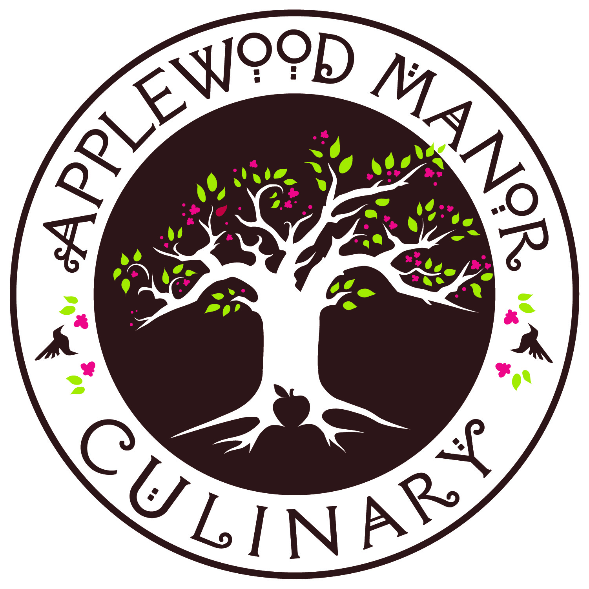
    <div class="name">Applewood Manor<em>Culinary</em></div>
  </div>
  <nav>
    <a href="#about"><span class="num">01</span>About Robin</a>
    <a href="#classes"><span class="num">02</span>Classes</a>
    <a href="#how"><span class="num">03</span>How it works</a>
    <a href="#upcoming"><span class="num">04</span>Upcoming</a>
    <a href="#notes"><span class="num">05</span>Notes</a>
    <a href="#gallery"><span class="num">06</span>Gallery</a>
  </nav>
  <div class="cta"><a href="#contact">Book a class</a></div>
</header>

<section class="hero">
  <div class="hero-text">
    <div class="eyebrow">Asheville · North Carolina</div>
    <h1>The kitchen<br>is <em>open.</em></h1>
    <p class="subline">Small-group cooking and bread-baking classes in Robin Collins's home kitchen at Applewood Manor.</p>
    <div class="meta">
      <div><strong>4 Students Max</strong></div>
      <div><strong>From $175</strong> per person</div>
      <div><strong>3+ hours</strong> per class</div>
    </div>
  </div>
  <div class="hero-image">
    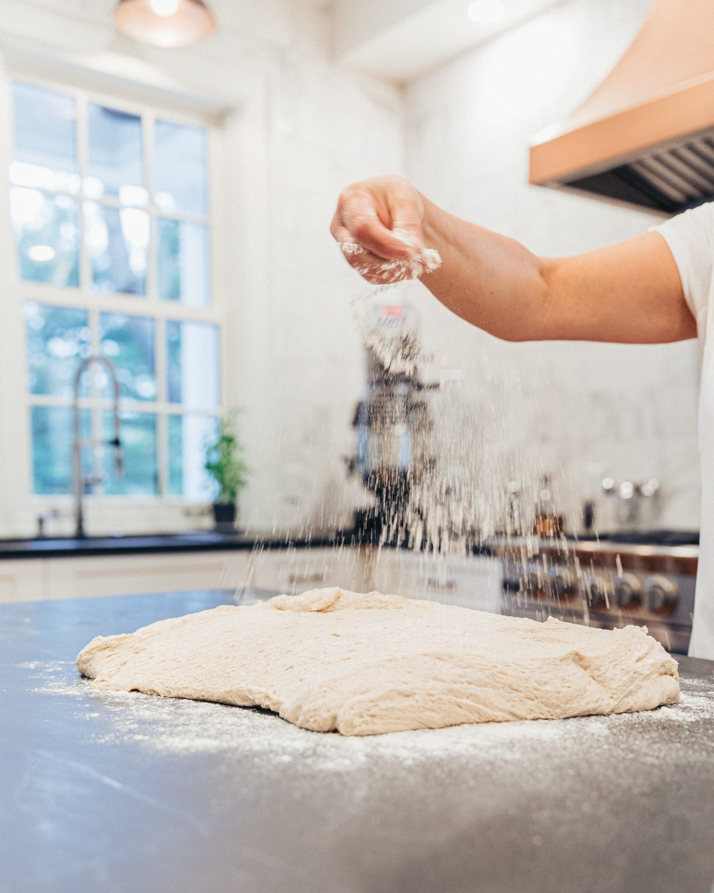
    <div class="caption"><span>The kitchen at Applewood</span>Where every class begins, with a little flour and a long table.</div>
  </div>
  <div class="scroll-cue">Scroll</div>
</section>

<div class="ornament">
  <svg viewBox="0 0 32 32" fill="none" xmlns="http://www.w3.org/2000/svg">
    <circle cx="16" cy="16" r="3" fill="#D63584"/>
    <path d="M16 6 L16 26 M6 16 L26 16 M9 9 L23 23 M23 9 L9 23" stroke="#7BA428" stroke-width="1" stroke-linecap="round"/>
    <circle cx="16" cy="6" r="1.5" fill="#7BA428"/>
    <circle cx="16" cy="26" r="1.5" fill="#7BA428"/>
    <circle cx="6" cy="16" r="1.5" fill="#7BA428"/>
    <circle cx="26" cy="16" r="1.5" fill="#7BA428"/>
  </svg>
</div>

<section id="about" class="about">
  <div class="about-inner">
    <div class="about-photo">
      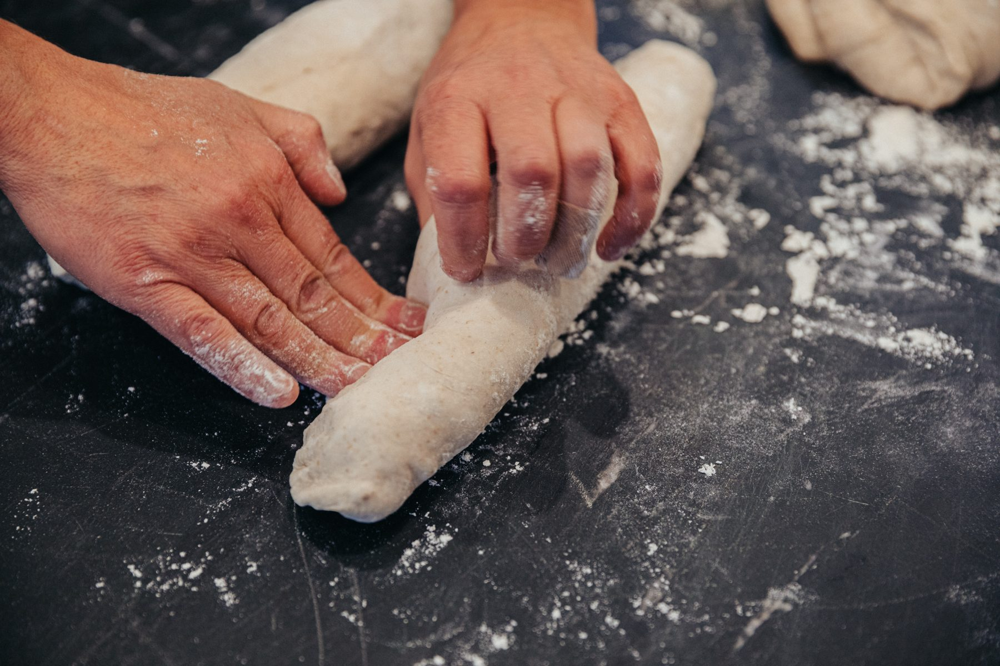
      <div class="badge"><span>Robin Collins</span>Applewood Manor Culinary</div>
    </div>
    <div class="about-text">
      <div class="label">No. 01 · About Robin</div>
      <h2>A passion <em>passed down</em>, and shared at the table.</h2>
      <p>Robin's love of cooking came from her mother, Mary Grace Ritchey. Cooking alongside her mother and sisters for family meals — drawing on her Italian and Lebanese heritage — gave her the confidence to explore other cuisines wherever life took her.</p>
      <p>Robin has lived in several states and travelled widely, exploring each cuisine and often taking classes to master the techniques. Over the years she has hosted dinners for up to fifty, sharing her love of food, wine, and bread baking with friends, family, and her husband Stephen's work associates.</p>
      <p>In 2020 Robin bought and ran the Applewood Manor Bed and Breakfast, where she continued cooking for guests, hosted Michelin-star chefs at special dinners, and taught small culinary classes. In 2024 the inn closed and Applewood Manor became home. Today, Robin is opening her kitchen again — to teach, to share, and perhaps to pass along a few family recipe secrets.</p>
      <div class="signature">— Robin</div>
    </div>
  </div>
</section>

<section class="credentials">
  <div class="credentials-inner">
    <div class="label">Studied · Cooked · Hosted</div>
    <h2>Twenty years <em>at the bench</em>,<br>and a few good kitchens along the way.</h2>

    <div class="creds-grid">
      <div class="creds-col">
        <h3>Studied at</h3>
        <ul>
          <li>The French Culinary Institute <em>— New York, NY</em></li>
          <li>E5 Bakery <em>— London, UK</em></li>
          <li>The Bertinet Kitchen <em>— Bath, UK</em></li>
          <li>La Vecchia Scuola Bolognese (VSB) <em>— Bologna, Italy</em></li>
          <li>Le Phébus <em>— Joucas, France</em></li>
          <li>Casa di Langa <em>— Piedmont, Italy</em></li>
        </ul>
      </div>
      <div class="creds-col">
        <h3>Cooked alongside</h3>
        <ul>
          <li>Mads Refslund <em>— Ilis, Brooklyn, NY</em></li>
          <li>Chef Xavier Mathieu <em>— Le Phébus, Joucas, France</em></li>
          <li>Chef Marc Fosh <em>— Restaurant Marc Fosh, Palma, Mallorca</em></li>
          <li>Friends, family and guests of Applewood Manor <em>— for over four years</em></li>
        </ul>
      </div>
    </div>
  </div>
</section>

<section id="classes" class="classes">
  <div class="section-head">
    <div class="label">No. 02 · The Classes</div>
    <h2>Cooking &amp; <em>bread-baking</em> classes</h2>
    <p class="lede">Each class is small — a maximum of four — and built so you'll leave with the confidence to make it again at home. Choose a class below, or get in touch and we'll build one together.</p>
  </div>

  <div class="classes-grid">

    <article class="class-card">
      <div class="img-wrap">
        <span class="num-tag">01 / Bread</span>
        <span class="duration">3 hrs</span>
        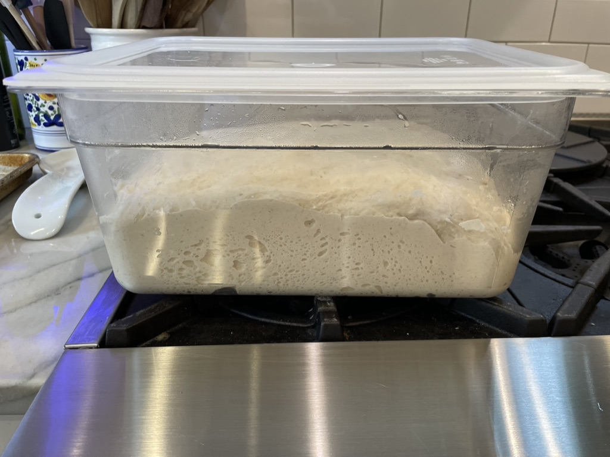
      </div>
      <div class="cat">Everyday Bread Baking</div>
      <h3>White Dough</h3>
      <p>Baguettes and basic shapes by hand — shaping, scoring, baking. One dough, many breads to take home.</p>
      <div class="foot"><div class="price">From <strong>$175</strong><span>/ person · contact for details</span></div><div class="read">Book this class →</div></div>
    </article>

    <article class="class-card">
      <div class="img-wrap">
        <span class="num-tag">02 / Bread</span>
        <span class="duration">4 hrs</span>
        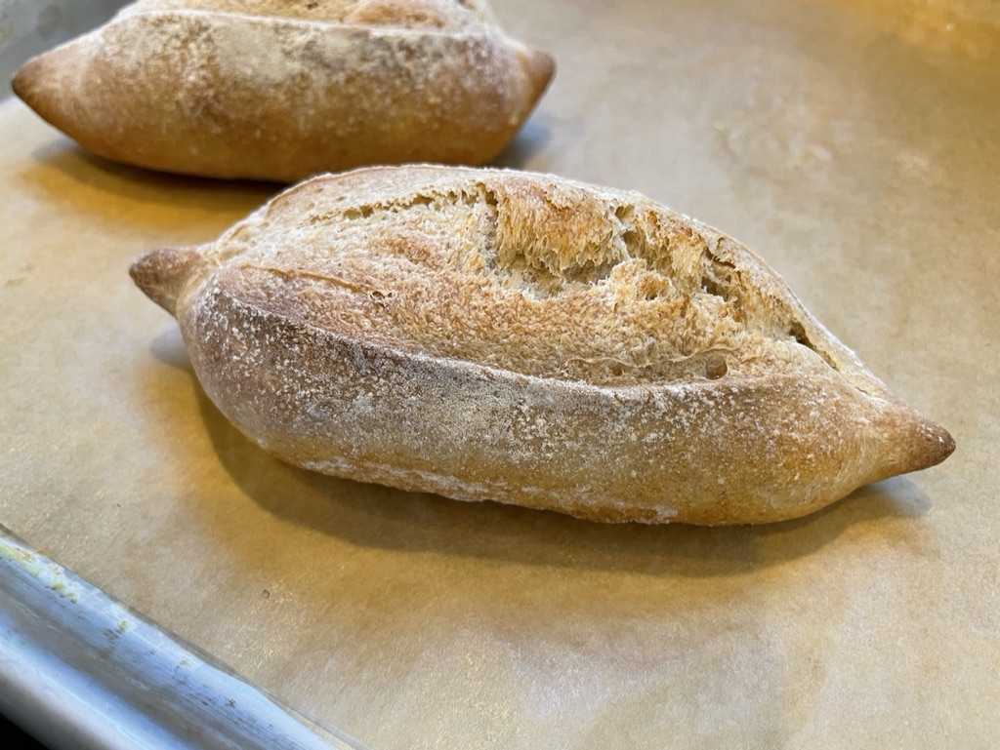
      </div>
      <div class="cat">Everyday Bread Baking</div>
      <h3>Fermented Bread</h3>
      <p>Mixed-grain breads, sourdough, ciabatta — and a real understanding of fermented dough that travels home with you.</p>
      <div class="foot"><div class="price">From <strong>$175</strong><span>/ person · contact for details</span></div><div class="read">Book this class →</div></div>
    </article>

    <article class="class-card">
      <div class="img-wrap">
        <span class="num-tag">03 / Sweet</span>
        <span class="duration">3 hrs</span>
        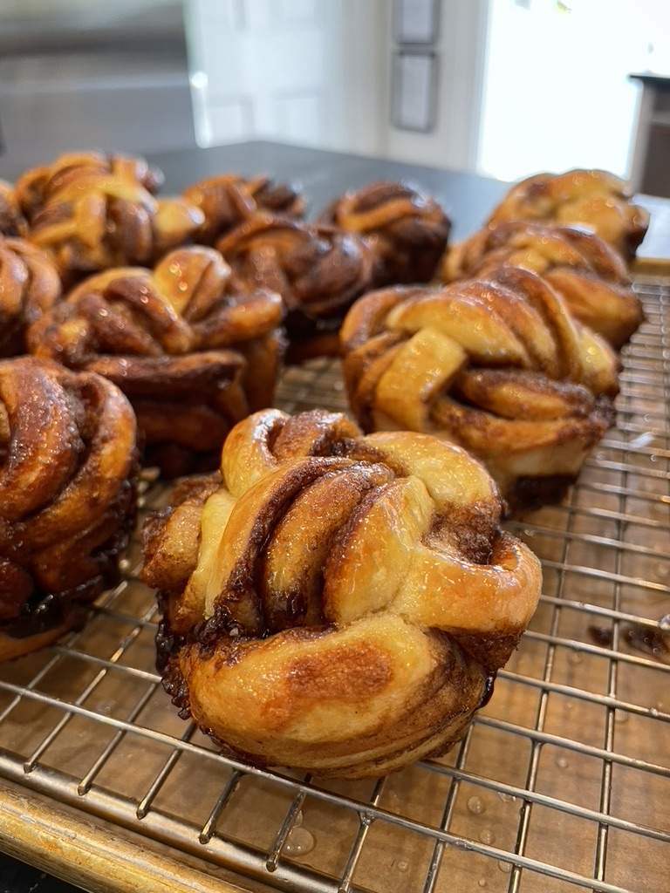
      </div>
      <div class="cat">Everyday Bread Baking</div>
      <h3>Twisted Cinnamon Buns</h3>
      <p>Sweet enriched dough shaped into golden, glossy knots. Easier than they look. Better than any bakery's.</p>
      <div class="foot"><div class="price">From <strong>$175</strong><span>/ person · contact for details</span></div><div class="read">Book this class →</div></div>
    </article>

    <article class="class-card">
      <div class="img-wrap">
        <span class="num-tag">04 / Bread</span>
        <span class="duration">3 hrs</span>
        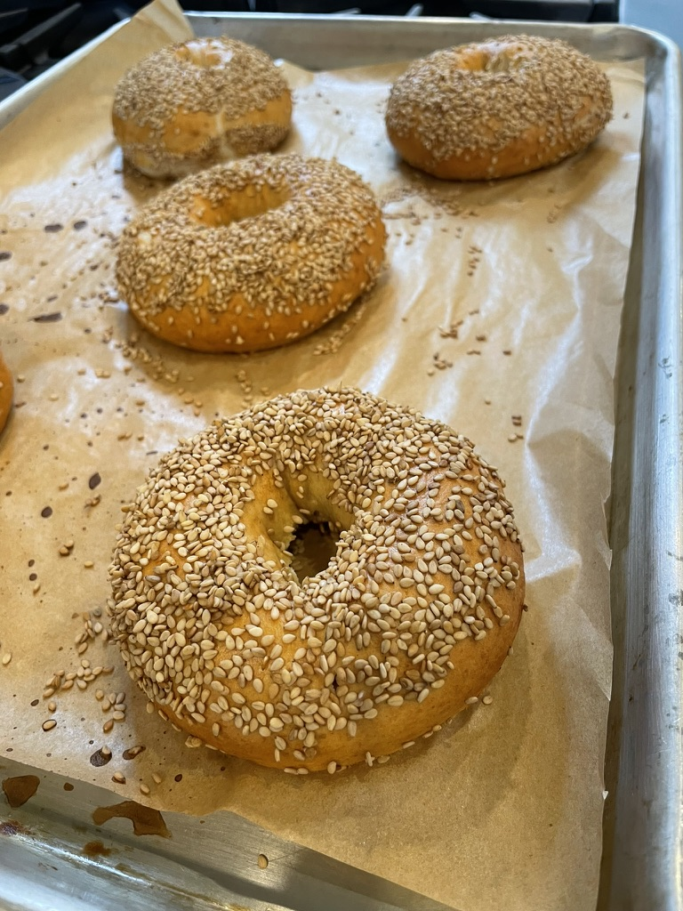
      </div>
      <div class="cat">Everyday Bread Baking</div>
      <h3>Bagels</h3>
      <p>Boil-then-bake the proper way: chewy, crusted, and far better than anything store-bought. Plain or seeded.</p>
      <div class="foot"><div class="price">From <strong>$175</strong><span>/ person · contact for details</span></div><div class="read">Book this class →</div></div>
    </article>

    <article class="class-card">
      <div class="img-wrap">
        <span class="num-tag">05 / Bread</span>
        <span class="duration">3 hrs</span>
        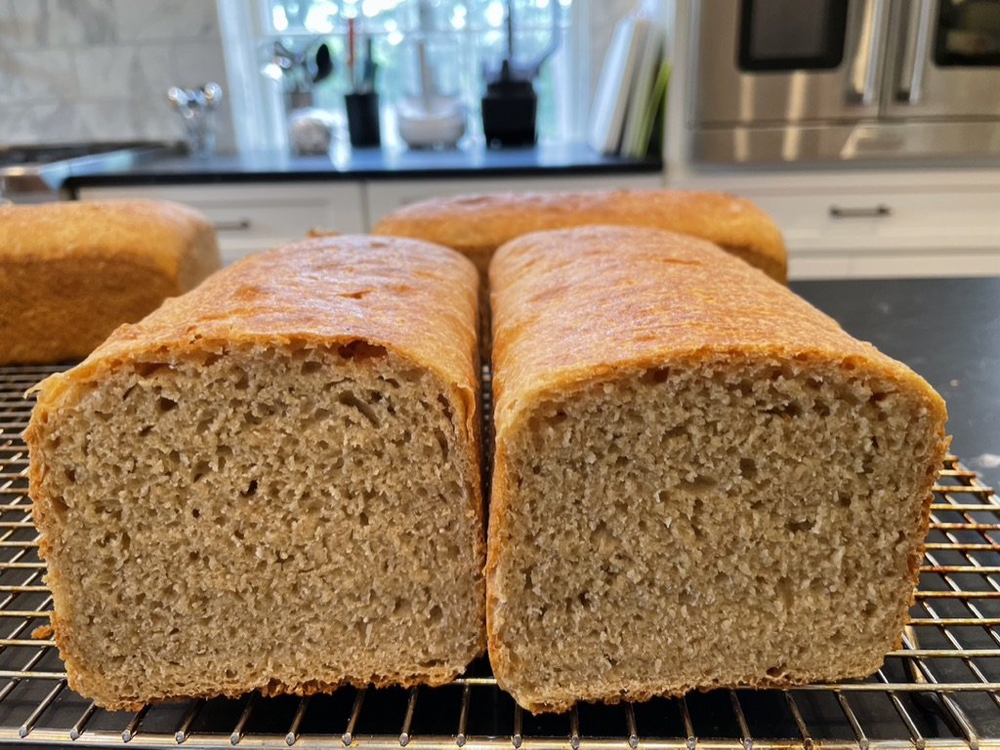
      </div>
      <div class="cat">Everyday Bread Baking</div>
      <h3>Whole-Grain Sandwich Bread</h3>
      <p>Your weekly loaf, sorted. Soft, sliceable, freezes well. Never buy grocery-aisle bread again.</p>
      <div class="foot"><div class="price">From <strong>$175</strong><span>/ person · contact for details</span></div><div class="read">Book this class →</div></div>
    </article>

    <article class="class-card">
      <div class="img-wrap">
        <span class="num-tag">06 / Bread</span>
        <span class="duration">4 hrs</span>
        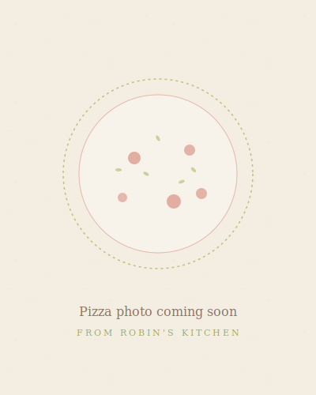
      </div>
      <div class="cat">Everyday Bread Baking</div>
      <h3>Olive Oil Dough</h3>
      <p>One supple dough; three things to do with it: pizza, focaccia, and an olive bread worth showing off.</p>
      <div class="foot"><div class="price">From <strong>$175</strong><span>/ person · contact for details</span></div><div class="read">Book this class →</div></div>
    </article>

    <article class="class-card">
      <div class="img-wrap">
        <span class="num-tag">07 / Pasta</span>
        <span class="duration">3 hrs</span>
        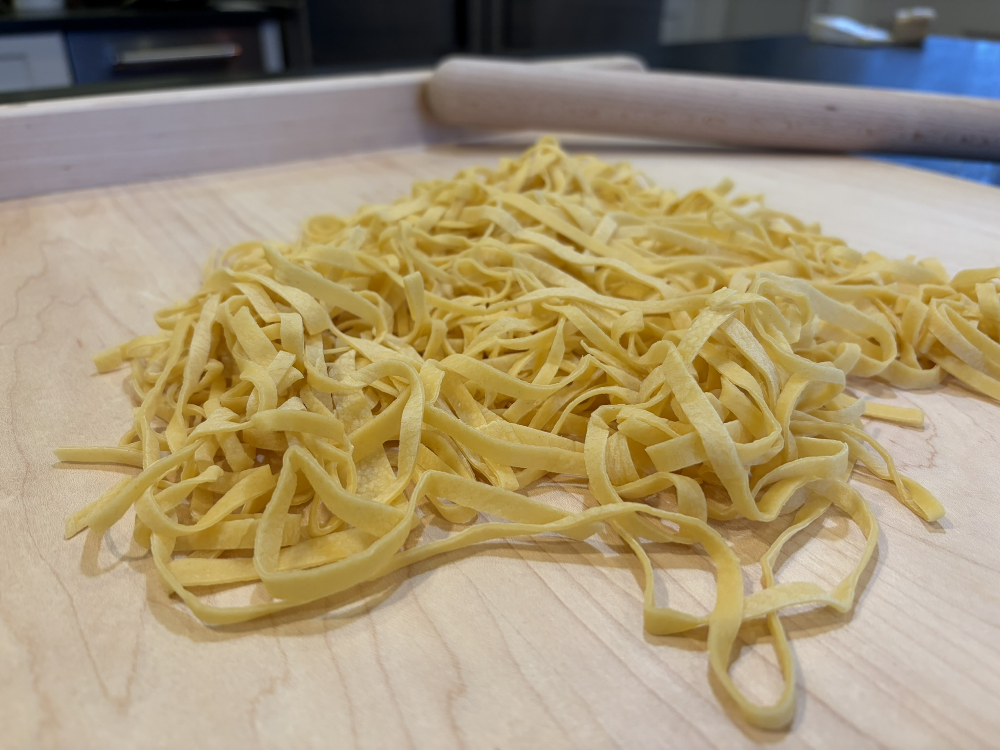
      </div>
      <div class="cat">Home Cooking · Dinner Series</div>
      <h3>Homemade Pasta &amp; Sauces</h3>
      <p>Hand-rolled pasta with Robin's family red sauce — the recipe she grew up with, taught the way it was taught to her.</p>
      <div class="foot"><div class="price">From <strong>$175</strong><span>/ person · contact for details</span></div><div class="read">Book this class →</div></div>
    </article>

    <article class="class-card">
      <div class="img-wrap">
        <span class="num-tag">08 / Pasta</span>
        <span class="duration">4 hrs</span>
        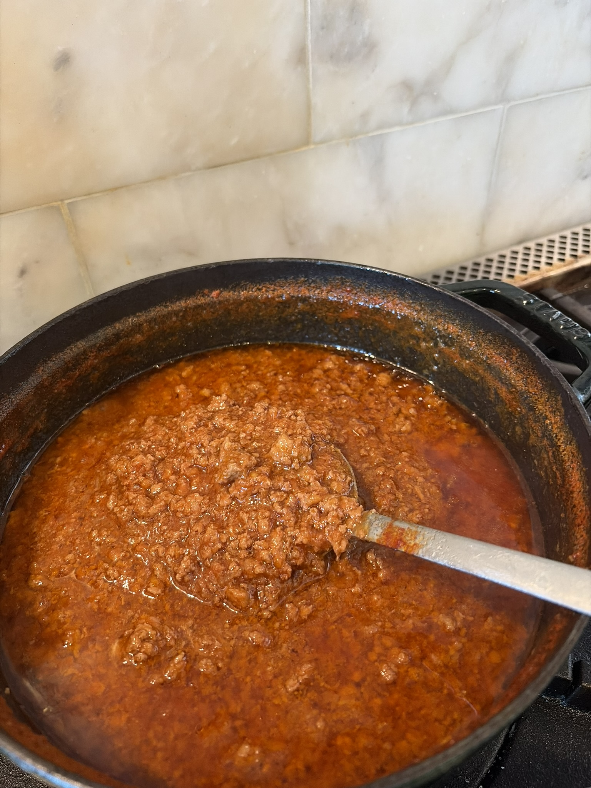
      </div>
      <div class="cat">Home Cooking · Dinner Series</div>
      <h3>Lasagna with Bolognese</h3>
      <p>The proper Bologna way — slow-simmered ragù, fresh sheets, layered patiently. Vegetable lasagna option available.</p>
      <div class="foot"><div class="price">From <strong>$175</strong><span>/ person · contact for details</span></div><div class="read">Book this class →</div></div>
    </article>

    <article class="class-card">
      <div class="img-wrap">
        <span class="num-tag">09 / Pasta</span>
        <span class="duration">3 hrs</span>
        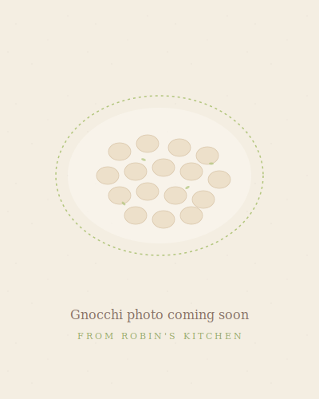
      </div>
      <div class="cat">Home Cooking · Dinner Series</div>
      <h3>Ricotta Gnocchi &amp; Pesto</h3>
      <p>Light, pillowy ricotta gnocchi — quicker than potato gnocchi, just as satisfying — with a bright pesto from scratch.</p>
      <div class="foot"><div class="price">From <strong>$175</strong><span>/ person · contact for details</span></div><div class="read">Book this class →</div></div>
    </article>

    <article class="class-card">
      <div class="img-wrap">
        <span class="num-tag">10 / Make-ahead</span>
        <span class="duration">3 hrs</span>
        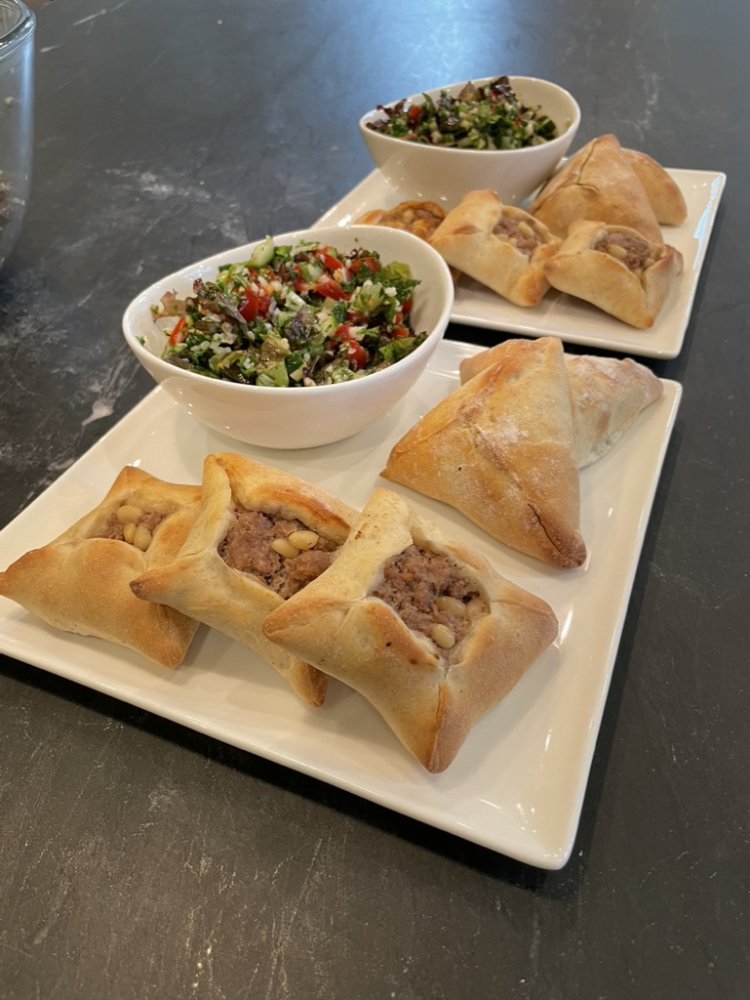
      </div>
      <div class="cat">Home Cooking · Make-ahead</div>
      <h3>Meat &amp; Spinach Pies</h3>
      <p>Lebanese-style hand pies for the freezer — quick lunches, easy snacks, real dinner when the day got away from you.</p>
      <div class="foot"><div class="price">From <strong>$175</strong><span>/ person · contact for details</span></div><div class="read">Book this class →</div></div>
    </article>

    <article class="class-card">
      <div class="img-wrap">
        <span class="num-tag">11 / Make-ahead</span>
        <span class="duration">3 hrs</span>
        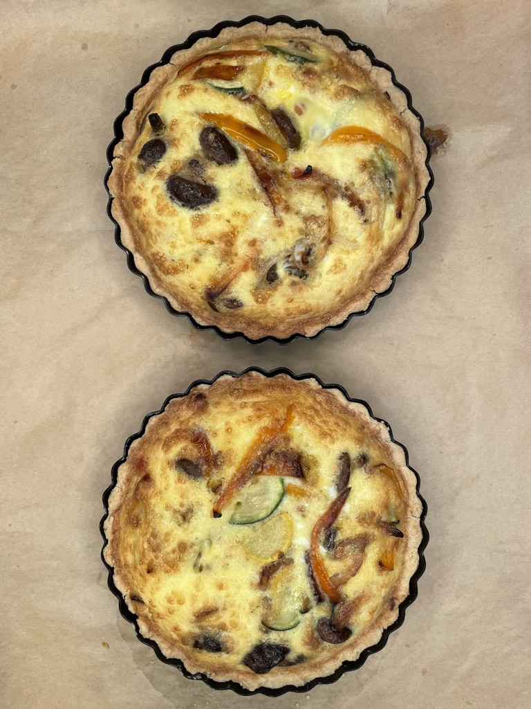
      </div>
      <div class="cat">Home Cooking · Pies &amp; Tarts</div>
      <h3>Pie Crust — Sweet &amp; Savory</h3>
      <p>One crust, endless possibilities — quiches, tarts, fruit pies. Choose your direction; we bake all morning.</p>
      <div class="foot"><div class="price">From <strong>$175</strong><span>/ person · contact for details</span></div><div class="read">Book this class →</div></div>
    </article>

    <article class="class-card">
      <div class="img-wrap">
        <span class="num-tag">12 / Custom</span>
        <span class="duration">By request</span>
        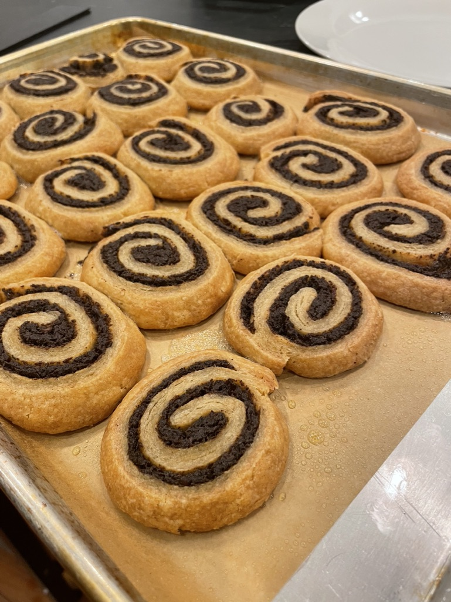
      </div>
      <div class="cat">For groups · For seasons · For you</div>
      <h3>Build Your Own Class</h3>
      <p>Coming up: summer pies, ice cream, holiday desserts, Christmas cookies. Or invite a few friends and we'll build something together.</p>
      <div class="foot"><div class="price">From <strong>$175</strong><span>/ person · contact for details</span></div><div class="read">Get in touch →</div></div>
    </article>

  </div>
</section>

<section id="how" class="how">
  <div class="section-head">
    <div class="label">No. 03 · How it works</div>
    <h2>From <em>email</em> to apron, in four steps.</h2>
    <p class="lede">Every class begins with one student's request — then opens up to fill the four seats. So your friends, neighbours, or someone new can join you at the table.</p>
  </div>

  <div class="how-grid">
    <div class="how-step">
      <div class="num">i.</div>
      <h3>Pick a class</h3>
      <p>Browse the classes above. Each one runs about three hours unless noted, with a maximum of four students at the kitchen counter.</p>
    </div>
    <div class="how-step">
      <div class="num">ii.</div>
      <h3>Email Robin</h3>
      <p>Tell her which class, your preferred dates, and how many of you. She'll confirm a date that works — and send pricing if the class needs more than the basic rate.</p>
    </div>
    <div class="how-step">
      <div class="num">iii.</div>
      <h3>The class opens</h3>
      <p>Once your date is set, Robin lists it under <em>Upcoming</em> on the site — friends, neighbours, or strangers can join you until the four seats are filled.</p>
    </div>
    <div class="how-step">
      <div class="num">iv.</div>
      <h3>Cook &amp; carry home</h3>
      <p>Show up hungry. Leave with full hands — what you made, what you learned, and a few of Robin's notes for at home.</p>
    </div>
  </div>
</section>

<section id="upcoming" class="upcoming">
  <div class="upcoming-inner">
    <div class="section-head">
      <div class="label">No. 04 · Upcoming</div>
      <h2>Open <em>spaces</em> at the table</h2>
      <p class="lede">A mix of seasonal classes Robin has put on the calendar and open classes from students who have already booked. If a date catches your eye, email Robin to claim a seat.</p>
    </div>

    <div class="schedule-list">
      <div class="schedule-item">
        <div class="date-block"><div class="day">17</div><div class="mo">May</div></div>
        <div class="info">
          <h4>White Dough · Baguettes &amp; Basic Shapes</h4>
          <p>Saturday, 9am – 12pm · Hands-on bread basics. Beginners welcome. <em>Open class.</em></p>
        </div>
        <div class="seats"><div class="n">3 seats</div><div class="l">of 4</div></div>
        <a href="#contact" class="book">Reserve</a>
      </div>

      <div class="schedule-item">
        <div class="date-block"><div class="day">07</div><div class="mo">Jun</div></div>
        <div class="info">
          <h4>Summer Pies · Stone Fruit Season</h4>
          <p>Saturday, 10am – 2pm · Peach, plum, blueberry — whatever the market has that morning. <em>Seasonal.</em></p>
        </div>
        <div class="seats"><div class="n">4 seats</div><div class="l">of 4</div></div>
        <a href="#contact" class="book">Reserve</a>
      </div>

      <div class="schedule-item">
        <div class="date-block"><div class="day">12</div><div class="mo">Jul</div></div>
        <div class="info">
          <h4>Homemade Ice Cream · Three Ways</h4>
          <p>Saturday, 11am – 2pm · Custard, no-churn, and a sorbet. Cold mornings made worth it. <em>Seasonal.</em></p>
        </div>
        <div class="seats"><div class="n">4 seats</div><div class="l">of 4</div></div>
        <a href="#contact" class="book">Reserve</a>
      </div>

      <div class="schedule-item">
        <div class="date-block"><div class="day">25</div><div class="mo">Oct</div></div>
        <div class="info">
          <h4>Holiday Bread Baking · Get Ahead</h4>
          <p>Saturday, 9am – 1pm · Christmas-morning loaves you can make and freeze. <em>Seasonal.</em></p>
        </div>
        <div class="seats"><div class="n">4 seats</div><div class="l">of 4</div></div>
        <a href="#contact" class="book">Reserve</a>
      </div>

      <div class="schedule-item">
        <div class="date-block"><div class="day">06</div><div class="mo">Dec</div></div>
        <div class="info">
          <h4>Christmas Cookie Day · Five Cookies, One Tin</h4>
          <p>Saturday, 10am – 3pm · Five classics for the holiday tin. Bring a box, take some home. <em>Seasonal.</em></p>
        </div>
        <div class="seats"><div class="n">4 seats</div><div class="l">of 4</div></div>
        <a href="#contact" class="book">Reserve</a>
      </div>
    </div>

    <p class="schedule-note">Don't see what you're looking for? <a href="#contact" style="color:var(--berry);text-decoration:underline;">Email Robin</a> and she'll schedule a class around you.</p>
  </div>
</section>

<section id="notes" class="notes">
  <div class="section-head">
    <div class="label">No. 05 · Notes</div>
    <h2>Notes from <em>Robin's Kitchen</em></h2>
    <p class="lede">Mondays, mostly. Quick thoughts, a recipe, what to do when the dough doesn't rise — and small things from the week worth writing down.</p>
  </div>

  <div class="notes-grid">
    <article class="note featured">
      <div class="img-wrap">
        <span class="badge">Latest · Monday Notes</span>
        
      </div>
      <div class="meta-row">
        <span>Monday Notes</span><span class="dot">·</span><span>5 min read</span>
      </div>
      <h3>When the dough doesn't rise — and other small mornings</h3>
      <p>Last Tuesday I pulled a bowl out from the proofing spot and the dough hadn't budged. Here's what I check, in order, before I start over.</p>
      <span class="read">Read the note →</span>
    </article>

    <article class="note">
      <div class="img-wrap">
        
      </div>
      <div class="meta-row">
        <span>Recipes</span><span class="dot">·</span><span>4 min read</span>
      </div>
      <h3>The Saturday cinnamon knots, with notes</h3>
      <p>The recipe my B&amp;B guests asked for at every checkout. The trick is in the second proof.</p>
      <span class="read">Read the note →</span>
    </article>

    <article class="note">
      <div class="img-wrap">
        
      </div>
      <div class="meta-row">
        <span>From Bologna</span><span class="dot">·</span><span>6 min read</span>
      </div>
      <h3>What I learned at VSB — and the one rule I never break</h3>
      <p>A few notes from a week at La Vecchia Scuola Bolognese, and the small Italian habit that changed how I cook at home.</p>
      <span class="read">Read the note →</span>
    </article>
  </div>

  <div class="notes-cta">
    <a href="#">Read all notes →</a>
  </div>
</section>

<section id="gallery" class="gallery">
  <div class="section-head">
    <div class="label">No. 06 · From the kitchen</div>
    <h2>From the <em>counter</em></h2>
    <p class="lede">A handful of mornings, mostly photographed before everything got eaten.</p>
  </div>

  <div class="gallery-grid">
    <div class="g g1">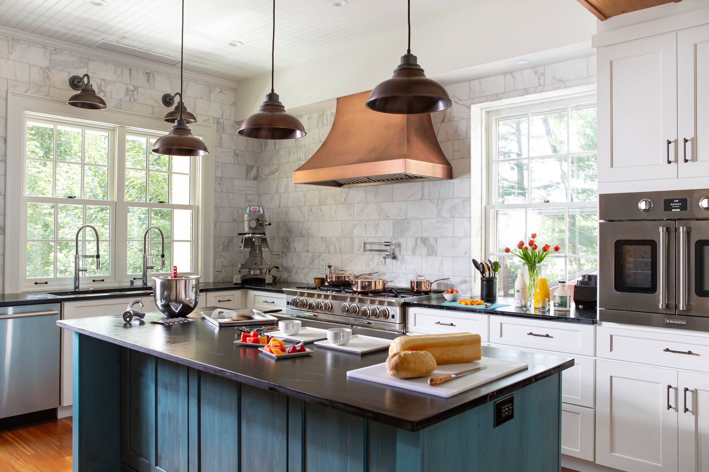</div>
    <div class="g g2"></div>
    <div class="g g3"></div>
    <div class="g g4"></div>
    <div class="g g5"></div>
    <div class="g g6"></div>
  </div>
</section>

<section id="contact" class="contact">
  <div class="contact-inner">
    <div class="seal"></div>
    <h2>Pull up a <em>chair.</em></h2>
    <p>Tell Robin which class, when you'd like to come, and how many of you. She writes back personally — usually within a day or two.</p>
    <a href="mailto:culinary@applewoodmanor.com" class="email-btn">culinary@applewoodmanor.com</a>
    <div class="small">Asheville · North Carolina · By appointment</div>
  </div>
</section>

<footer>
  <div class="foot-inner">
    <div class="brand-blk">
      <div class="logo-row">
        
        <div class="name">Applewood Manor<em>Culinary</em></div>
      </div>
      <p>The home kitchen of Robin Collins,</p>
      <p>at Applewood Manor — Asheville, NC.</p>
      <p style="margin-top:14px;font-style:italic;">Cooking and bread-baking classes,<br>by appointment, year-round.</p>
    </div>
    <div>
      <h4>The Site</h4>
      <ul>
        <li><a href="#about">About Robin</a></li>
        <li><a href="#classes">Classes</a></li>
        <li><a href="#how">How it works</a></li>
        <li><a href="#upcoming">Upcoming dates</a></li>
        <li><a href="#notes">Notes</a></li>
        <li><a href="#gallery">Gallery</a></li>
      </ul>
    </div>
    <div>
      <h4>Visit</h4>
      <ul>
        <li><a href="https://www.applewoodmanor.com" target="_blank">The Manor</a></li>
        <li><a href="https://www.instagram.com/applewood_manor/" target="_blank">Instagram</a></li>
      </ul>
    </div>
    <div>
      <h4>Get in touch</h4>
      <ul>
        <li><a href="mailto:culinary@applewoodmanor.com">culinary@applewoodmanor.com</a></li>
        <li><a href="#contact">Book a class</a></li>
      </ul>
    </div>
  </div>
  <div class="foot-bot">
    <div>© 2026 Applewood Manor Culinary · Robin Collins, Asheville NC</div>
    <div class="links">
      <a href="#">Privacy</a>
      <a href="#">Terms</a>
    </div>
  </div>
</footer>

<script>
  document.querySelectorAll('a[href^="#"]').forEach(a => {
    a.addEventListener('click', e => {
      const id = a.getAttribute('href');
      if (id.length > 1) {
        const t = document.querySelector(id);
        if (t) {
          e.preventDefault();
          window.scrollTo({ top: t.offsetTop - 60, behavior: 'smooth' });
        }
      }
    });
  });

  const io = new IntersectionObserver(entries => {
    entries.forEach(e => {
      if (e.isIntersecting) {
        e.target.style.opacity = 1;
        e.target.style.transform = 'translateY(0)';
        io.unobserve(e.target);
      }
    });
  }, { threshold: 0.08 });

  document.querySelectorAll('.class-card, .how-step, .schedule-item, .creds-col, .note, .gallery-grid .g, .about-photo, .about-text').forEach((el, i) => {
    el.style.opacity = 0;
    el.style.transform = 'translateY(20px)';
    el.style.transition = `opacity 0.7s ease ${(i % 6) * 0.05}s, transform 0.7s ease ${(i % 6) * 0.05}s`;
    io.observe(el);
  });
</script>

</body>
</html>
```
